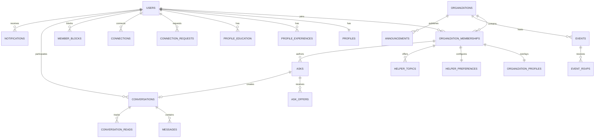

# BridgeCircle database v2 contract

**Status:** Foundation and Conversation Primitive implemented and verified locally; later domains and remote cutovers pending; not live
**Decision:** [ADR 0015](../decisions/0015-prelaunch-v2-database-reset.md)
**Current live schema:** [Data model — Phase 1 launch](data-model.md)
**Approved product behavior:** [`FLOWS.md`](../experience/ui/design-system/handoff/bridgecircle/project/uploads/FLOWS.md)

This document is the canonical implementation contract for the pre-launch
database rebuild. `codex/redesign-v2` now contains the active v2 baseline,
deterministic seed, generated types, pgTAP suite, and completed Foundation and
Conversation Primitive application boundaries. Identity, memberships,
self-profile/onboarding, shell context, notifications, conversation storage,
bounded reads, message commands, read cursors, typing, and private Broadcast
are locally verified. Later product domains and both remote databases remain
on the legacy contract until their ports and separately approved cutovers
land. Nothing in this document authorizes a remote database reset.

## Goal

Build a clean Supabase Postgres schema that makes the redesigned BridgeCircle
flows correct by construction:

- one direct/circle Help model;
- one conversation and message model;
- membership-correct multi-organization data;
- database-enforced Ask, offer, connection, block, and anonymity rules;
- reliable asynchronous notification and email delivery;
- least-privilege grants and auditable RLS;
- deterministic local rebuilds and one reviewed v2 migration baseline.

## Out of scope

- a new ORM, API framework, auth provider, database vendor, email provider,
  or LLM provider;
- group conversations, attachments, reactions, or message editing;
- scoring, streaks, public activity feeds, or help leaderboards;
- offer withdrawal unless a later product decision adds it;
- a compatibility layer for legacy application data;
- remote reset or migration-history repair before a separately approved
  cutover;
- approximate vector indexes before a measured query-plan need.

## Sources and precedence

When sources disagree, use this order for the v2 implementation:

1. [ADR 0015](../decisions/0015-prelaunch-v2-database-reset.md)
2. this contract
3. current `FLOWS.md` Help, Messages, People, and safety behavior
4. still-applicable accepted ADRs
5. the older Phase 1 spec and launch-cut documents

Code remains canonical for the current live application until v2 is deployed.

## Non-negotiable invariants

1. **Membership keys organization activity.** Every organization-scoped row
   stores `organization_id` and references a membership proven to belong to
   that organization.
2. **User keys person relationships.** Connections, blocks, conversations,
   messages, and notification recipients use user IDs and may outlive an
   organization membership.
3. **Direct and circle are one Ask concept, not one unconstrained state bag.**
   Per-kind CHECK constraints reject illegal combinations.
4. **One direct recipient.** A direct Ask has exactly one recipient; asking
   another person creates another Ask and consumes another slot.
5. **Five active asks.** `waiting`, `open`, and `accepted` consume a slot.
   `declined`, `retracted`, `resolved`, and `closed` do not.
6. **Published asks are immutable.** Question, message, recipient, reach, and
   anonymity cannot be edited after insert.
7. **One accepted offer.** A circle Ask may have many offers but at most one
   accepted offer.
8. **One conversation per Ask.** Direct user pairs have at most one direct
   conversation but may have many Ask conversations.
9. **No polymorphic message parent.** Every message has a real conversation
   foreign key.
10. **Blocking is centralized and symmetric in effect.** One directional row
    records ownership; `private.is_blocked(a,b)` checks both directions.
11. **Anonymous means database-hidden.** An unmatched or unaccepted helper
    cannot obtain the Ask author ID through table, view, RPC, Realtime, or
    error output.
12. **No external calls in transactions.** AI, Resend, and enrichment work is
    queued only after durable state is written.
13. **Client retries are idempotent.** Ask, offer, connection, and message
    creation have caller-scoped request keys.
14. **No broad grants.** An object is unreachable unless its exact role grant
    and RLS policy allow it.

## Domain map



Private matching, enrichment, moderation, outbox, and audit relations are
omitted from the visual to keep the member-domain graph readable.

## Schema and API boundary

| Schema | Contents | Data API posture |
|---|---|---|
| `public` | RLS-protected application tables safe for direct relational access where explicitly granted | exposed |
| `api` | typed views and RPC wrappers; no base tables | exposed |
| `private` | privileged helpers, matching, embeddings, enrichment internals, reports, outbox, audit | not exposed |
| `auth` | Supabase Auth | managed; preserved |
| `storage` | Supabase Storage metadata and policies | managed; preserved |

Rules:

- Revoke automatic table, function, sequence, and schema privileges from
  `public`, `anon`, and `authenticated` before adding explicit grants.
- Enable RLS on every `public` table, including tables intended only for
  server access.
- Prefer defense-in-depth RLS on `private` tables that contain user data.
- Create exposed views with `security_invoker = true`.
- Put security-definer implementations in `private`, set
  `search_path = ''`, and fully qualify every referenced object.
- Expose sensitive operations through fixed-signature `api` wrappers. The
  wrapper validates input and delegates; the private implementation validates
  authorization again.
- Never authorize from `raw_user_meta_data` or another user-editable JWT
  field.

References: [Supabase RLS](https://supabase.com/docs/guides/database/postgres/row-level-security),
[API security and grants](https://supabase.com/docs/guides/api/securing-your-api),
and [private security-definer helpers](https://supabase.com/docs/guides/troubleshooting/do-i-need-to-expose-security-definer-functions-in-row-level-security-policies-iI0uOw).

## SQL conventions

### Identifiers

- Use `uuid default gen_random_uuid()` for externally addressed entities and
  Auth-linked records.
- Use `bigint generated always as identity` for append-only, high-volume
  internals such as messages, notifications, outbox jobs, and audit events.
- Use lowercase `snake_case` names.
- Use `text` plus named CHECK constraints for evolving statuses; do not create
  new Postgres enum types.

### Values

- Use `timestamptz` for all timestamps.
- Use `text`, not arbitrary `varchar(n)`; add semantic length CHECKs where a
  product limit matters.
- Use JSONB only for provider snapshots, evidence, immutable event payloads,
  and outbox payloads. Do not store queryable core relationships in JSONB.
- Store normalized labels separately when case-insensitive uniqueness matters.

### Foreign keys and deletion

- Index every FK in its leading column order unless an existing PK/unique
  index already covers it.
- Use `on delete cascade` only when the child has no meaning without the
  parent, such as Ask offers or conversation read cursors.
- Use `on delete restrict` where deletion must pass through an explicit
  lifecycle, such as organizations and account identity.
- Use `on delete set null` for optional actor/audit references that should not
  erase history.

Account deletion uses pseudonymized retention. `public.users` is a non-PII
tombstone identity and deliberately does not cascade from `auth.users`.
Deleting an account removes Auth credentials, profiles, private files,
preferences, active authored Asks/offers, notifications, and connection
edges; revokes memberships; and closes unanswered requests addressed to the
deleted member. Accepted Ask/conversation/message history and immutable
safety evidence remain associated with the tombstone UUID so counterpart
members do not lose shared history. No user FK may blanket-cascade through
another member's conversation or safety history.

### Time and pagination

- Paginate feeds with `(created_at, id)` or `(last_message_at, id)` cursors;
  do not use deep `offset` pagination.
- Put equality columns before range/sort columns in composite indexes.
- Use partial indexes for active, pending, unread, or unprocessed subsets.

## Identity and organization tables

### `public.users`

Application shadow of Supabase Auth.

| Column | Contract |
|---|---|
| `id` | `uuid primary key`; initially the same value as `auth.users.id`, but intentionally not an FK so the tombstone survives Auth deletion |
| `account_state` | `active`, `deletion_scheduled`, or `deleted`; default `active` |
| `onboarding_completed_at` | nullable `timestamptz` |
| `last_seen_at` | nullable `timestamptz` |
| `delete_scheduled_for` | nullable `timestamptz` |
| `delete_reason` | nullable `text`, max 2,000 chars |
| `delete_initiated_by_admin` | `boolean not null default false` |
| `deleted_at` | nullable `timestamptz`; required only for the `deleted` state |
| `created_at` | `timestamptz not null default now()` |

The `auth.users` insert trigger creates this row. Client roles have no INSERT
or DELETE grant. A member may read their own row; org-mate discovery reads
profile projections rather than this table. An idempotent Auth-delete trigger
invokes the private pseudonymization routine so deleting a user from Supabase
administration cannot strand live application access.

### `public.organizations`

| Column | Contract |
|---|---|
| `id` | `uuid primary key default gen_random_uuid()` |
| `slug` | normalized lowercase `text not null unique` |
| `name` | nonblank `text not null`, max 200 chars |
| `requires_admin_approval` | `boolean not null default false` |
| `created_at`, `updated_at` | `timestamptz not null` |

Active members may read their organizations. Writes are administrative.

### `public.organization_memberships`

| Column | Contract |
|---|---|
| `id` | `uuid primary key default gen_random_uuid()` |
| `user_id` | FK to `users`, not null |
| `organization_id` | FK to `organizations`, not null |
| `status` | `pending`, `active`, `rejected`, or `revoked` |
| `joined_at` | nullable `timestamptz` |
| `approved_by_membership_id` | nullable FK to an approving membership |
| `approved_at` | nullable `timestamptz` |
| `created_at`, `updated_at` | `timestamptz not null` |

Constraints and indexes:

- unique `(user_id, organization_id)`;
- unique `(organization_id, id)` for composite child FKs;
- unique `(organization_id, user_id)` for membership/user resolution;
- `(user_id, organization_id) where status = 'active'`;
- `(organization_id, user_id) where status = 'active'`;
- approval fields are present only for `active`, `rejected`, or `revoked`
  decisions; `active` requires `joined_at`.

### Member context and circle selection

`api.get_my_member_context(preferred_membership_id)` is the single
self-routing projection. It derives the user from `auth.uid()` and returns the
account lifecycle, selected membership, chooser flag, account-global unread
notification count, and a fixed list of the caller's own memberships. Each
membership entry includes its status, organization ID/slug/name/approval
mode, the caller's own profile summary for that membership, and the caller's
roles. It never returns another member or ordinary organization content to a
non-active membership.

The application stores the preferred ID in the HTTP-only, SameSite=Lax
`bc_membership_id` cookie, with `Secure` enabled in production. The cookie is
only a preference: the database
accepts it only when it belongs to the caller and is `active` or `pending`.
Without a valid preference, selection is deterministic:

- exactly one active membership wins, regardless of pending memberships;
- with zero active memberships, exactly one pending membership wins;
- `requires_circle_choice` is true only for more than one active membership,
  or zero active memberships with more than one pending membership;
- rejected and revoked memberships remain in the self-context list for safe
  routing but are never selectable.

The unread count is deliberately person-scoped across organizations because
notifications belong to a recipient user. The selected-circle shell therefore
shows one account-global badge; per-circle badges require a later product
decision and query contract.

### `public.invites`

| Column | Contract |
|---|---|
| `id` | UUID PK |
| `organization_id` | organization FK, not null |
| `email` | original normalized email display value |
| `email_normalized` | lowercase trimmed email, not null |
| `token_hash` | `bytea not null unique`; raw token is never stored |
| `status` | `pending`, `accepted`, `expired`, or `revoked` |
| `full_name` | nullable prefill |
| `graduation_year` | nullable, valid-year CHECK |
| `sent_by_membership_id` | nullable same-org membership FK |
| `accepted_by_user_id` | nullable user FK |
| `accepted_at`, `expires_at`, `created_at` | lifecycle timestamps |

Indexes:

- unique `(organization_id, email_normalized) where status = 'pending'`;
- `(organization_id, status, created_at desc)`;
- `(expires_at) where status = 'pending'`.

Invite acceptance is a transactional server operation; browser roles cannot
read token hashes.

### `public.admin_role_assignments`

| Column | Contract |
|---|---|
| `id` | UUID PK |
| `organization_id` | organization FK, not null |
| `organization_membership_id` | same-org membership FK, not null |
| `role` | `super_admin`, `admin`, `event_moderator`, or `ambassador` |
| `granted_by_membership_id` | nullable same-org membership FK |
| `granted_at` | `timestamptz not null default now()` |

Unique `(organization_membership_id, role)`. Only active same-org
administrators may read assignments; changes go through audited admin
functions.

## Profile tables

### `public.profiles`

One global reusable identity card per user.

| Column | Contract |
|---|---|
| `user_id` | user FK and PK |
| `display_name` | nonblank `text not null`, max 200 |
| `preferred_name`, `name_other` | nullable text |
| `headline` | nullable text, max 280 |
| `current_employer`, `current_title`, `city`, `university`, `major` | nullable text |
| `linkedin_url` | nullable validated HTTPS URL |
| `avatar_path` | nullable Storage object path, not a signed URL |
| `resume_path` | nullable private Storage object path |
| `resume_uploaded_at` | nullable `timestamptz` |
| `created_at`, `updated_at` | `timestamptz not null` |

The table contains display data only. Provider snapshots and embeddings remain
private. Profile writes are owner-only through validated business functions.

The `avatars` bucket is deliberately public in the pre-launch baseline. A
stored `avatar_path` is resolved to a stable public URL, so anyone who obtains
that URL can continue fetching the bytes even after a block; block policies
prevent in-product discovery but cannot revoke a leaked or cached public URL.
This is an explicit performance and simplicity tradeoff for low-sensitivity
profile photos, not a general privacy mechanism. Resumes and other private
files must never use this bucket. If the product requires revocable avatar
access, convert the bucket to private and use authenticated downloads or
short-lived signed URLs as one coordinated migration. Supabase's
[bucket access model](https://supabase.com/docs/guides/storage/buckets/fundamentals)
is the operational reference for that change.

### `public.organization_profiles`

| Column | Contract |
|---|---|
| `organization_membership_id` | membership FK and PK |
| `organization_id` | organization FK, not null; composite membership FK |
| `graduation_year` | nullable small integer CHECKed between 1900 and 2100 |
| `bio` | nullable text, max 4,000 |
| `created_at`, `updated_at` | `timestamptz not null` |

Helper availability and topics do not live here.

### `public.profile_experiences`

| Column | Contract |
|---|---|
| `id` | bigint identity PK |
| `user_id` | user FK, not null |
| `employer`, `title` | nonblank text, not null |
| `start_year`, `start_month`, `end_year`, `end_month` | nullable bounded small integers |
| `description` | nullable text, max 4,000 |
| `sort_order` | nonnegative integer |
| `created_at`, `updated_at` | timestamps |

Year values are CHECKed between 1900 and 2100. Month values are 1 through 12.
CHECK constraints reject end dates before start dates and a partial end date
with no end year. Index `(user_id, sort_order, id)`.

### `public.profile_education`

Same lifecycle as experiences, with `school`, `degree`, and `field` in place
of employer/title. Index `(user_id, sort_order, id)` and apply the same date
checks.

### `public.profile_skills`

| Column | Contract |
|---|---|
| `user_id` | user FK |
| `name` | display text |
| `normalized_name` | lowercase/trimmed text |
| `sort_order` | nonnegative integer |

Primary key `(user_id, normalized_name)`; unique `(user_id, sort_order)`.

### `public.profile_field_visibility`

| Column | Contract |
|---|---|
| `organization_membership_id` | membership FK |
| `organization_id` | organization FK; composite same-org membership FK |
| `field_key` | `contact_links`, `career_history`, `education_history`, `bio`, or `skills` |
| `audience` | `organization`, `connections`, or `self` |
| `updated_at` | timestamp |

Primary key `(organization_membership_id, field_key)`. Store only overrides;
missing rows use product defaults. Directory identity fields required to make
the verified network work remain organization-visible.

## Help tables

### `public.helper_preferences`

One row per organization membership.

| Column | Contract |
|---|---|
| `organization_membership_id` | membership FK and PK |
| `organization_id` | organization FK; composite same-org membership FK |
| `open_to_help` | `boolean not null default true` |
| `max_pending_requests` | positive small integer, default 10; server-side abuse valve, not member-facing |
| `consecutive_timeouts` | nonnegative small integer, default 0, maximum 3 |
| `paused_at` | nullable timestamp |
| `pause_reason` | nullable `manual`, `unresponsive`, or `admin` |
| `created_at`, `updated_at` | timestamps |

Invariants:

- `open_to_help = false` when paused;
- `paused_at` and `pause_reason` are both null or both present;
- there is no time-based `paused_until`; reactivation is explicit;
- any direct Ask accept or decline resets `consecutive_timeouts` to zero;
- a third unanswered direct-Ask close sets the counter to three and pauses the
  helper.

### `public.helper_topics`

| Column | Contract |
|---|---|
| `organization_membership_id` | membership FK |
| `organization_id` | organization FK; composite same-org membership FK |
| `name` | nonblank display text, max 100 |
| `normalized_name` | lowercase/trimmed text |
| `sort_order` | integer from 0 through 4 |
| `created_at` | timestamp |

Primary key `(organization_membership_id, normalized_name)`; unique
`(organization_membership_id, sort_order)`. A transactional save function
enforces at most five topics.

### `public.asks`

One table represents direct and circle asks.

| Column | Contract |
|---|---|
| `id` | UUID PK |
| `organization_id` | organization FK, not null |
| `asker_membership_id` | same-org membership FK, not null |
| `kind` | `direct` or `circle` |
| `status` | per-kind state below |
| `recipient_membership_id` | nullable same-org membership FK; direct only |
| `question` | nonblank text, max 2,000 |
| `request_message` | nullable text, max 4,000; direct only |
| `reach` | nullable `matched` or `organization`; circle only |
| `anonymous_until_accepted` | boolean, default false; circle only |
| `decline_reason_code` | nullable `unavailable`, `outside_expertise`, or `other`; direct decline only |
| `decline_note` | nullable nonblank text, max 2,000; direct decline only |
| `closure_reason` | nullable `silence_timeout`, `admin`, `account_deleted`, or `blocked` |
| `outcome_note` | nullable text, max 2,000 |
| `reopened_from_ask_id` | nullable self-FK |
| `client_request_id` | UUID supplied by caller, not null |
| `reminder_sent_at`, `accepted_at`, `responded_at`, `ended_at` | nullable lifecycle timestamps |
| `expires_at` | not null; initially `created_at + 14 days` |
| `created_at`, `updated_at` | timestamps |

Named CHECK constraints must encode this equivalent predicate:

```sql
(
  kind = 'direct'
  and status in ('waiting', 'accepted', 'declined', 'retracted', 'resolved', 'closed')
  and recipient_membership_id is not null
  and reach is null
  and anonymous_until_accepted = false
  and request_message is not null
)
or
(
  kind = 'circle'
  and status in ('open', 'accepted', 'retracted', 'resolved', 'closed')
  and recipient_membership_id is null
  and reach in ('matched', 'organization')
  and request_message is null
)
```

Additional invariants:

- asker and direct recipient differ;
- `declined` requires direct kind, `decline_note`, `responded_at`, and
  `ended_at`;
- `accepted` requires `accepted_at` and `responded_at` but no `ended_at`;
- `resolved` requires `accepted_at`, `responded_at`, and `ended_at`;
- `retracted` and `closed` require `ended_at`;
- `closed` requires `closure_reason`;
- non-closed rows have no `closure_reason`;
- non-declined rows have no decline reason or note;
- a reopened Ask has the same organization and asker as its predecessor,
  enforced by a deferred constraint trigger;
- unique `(asker_membership_id, client_request_id)`.

Indexes:

- `(organization_id, asker_membership_id, created_at desc, id desc)`;
- `(recipient_membership_id, status, created_at desc) where kind = 'direct'`;
- `(organization_id, reach, created_at desc, id desc) where kind = 'circle' and status = 'open'`;
- `(expires_at, id) where status in ('waiting', 'open')`;
- `(asker_membership_id, created_at desc) where status in ('waiting', 'open', 'accepted')`;
- every standalone FK not already covered by a leading index.

Member roles receive no raw SELECT or UPDATE grant on sensitive Ask columns.
Ask detail and list reads flow through `api` projections so an anonymous
author ID cannot be requested directly.

### Ask lifecycle

Direct:

```text
waiting ──accept────▶ accepted ──resolve──▶ resolved
   │                     │
   ├─decline────────▶ declined
   ├─retract────────▶ retracted
   └─day-14 silence─▶ closed
```

Circle:

```text
open ──accept offer─▶ accepted ──resolve──▶ resolved
 │
 ├─retract─────────▶ retracted
 └─day-14 silence──▶ closed
```

An accepted Ask does not auto-close at day 14. The day-14 worker processes
only unanswered `waiting` and `open` rows. Accepted asks continue consuming a
slot until resolved or an explicit administrative/account lifecycle ends
them.

Allowed state changes are enforced by a BEFORE UPDATE transition trigger in
addition to snapshot CHECK constraints. The trigger also rejects changes to
published question, message, recipient, reach, anonymity, author, kind, or
organization.

### Five-active-Ask cap

`api.create_direct_ask` and `api.create_circle_ask` delegate to one private
creation implementation that:

1. verifies the current user owns the asker membership and it is active;
2. acquires `pg_advisory_xact_lock` on a stable 64-bit key derived from
   organization and asker membership;
3. counts `waiting`, `open`, and `accepted` rows;
4. rejects the sixth active Ask;
5. inserts the Ask and its `private.ask_events` record;
6. queues notification/outbox work;
7. commits before any external call.

### `public.ask_offers`

Circle-Ask offers only.

| Column | Contract |
|---|---|
| `id` | UUID PK |
| `organization_id` | organization FK, not null |
| `ask_id` | Ask FK, not null |
| `helper_membership_id` | same-org membership FK, not null |
| `status` | `pending`, `accepted`, `declined`, or `closed` |
| `offer_note` | nonblank text, max 4,000 |
| `decline_reason_code` | nullable `went_another_direction`, `not_right_fit`, or `other` |
| `decline_note` | nullable nonblank text, max 2,000 |
| `closure_reason` | nullable `accepted_elsewhere`, `ask_retracted`, `ask_closed`, `blocked`, or `admin` |
| `client_request_id` | caller UUID, not null |
| `responded_at`, `closed_at` | nullable timestamps |
| `created_at`, `updated_at` | timestamps |

Invariants:

- referenced Ask is circle kind and belongs to the same organization;
- helper membership belongs to the same organization and differs from asker;
- unique `(ask_id, helper_membership_id)`;
- unique `(helper_membership_id, client_request_id)`;
- partial unique `(ask_id) where status = 'accepted'`;
- `declined` requires `decline_note`, `responded_at`, and `closed_at`;
- `closed` requires `closure_reason` and `closed_at`;
- `accepted` requires `responded_at` and has no decline/closure note;
- `pending` has none of the response/closure fields.

Indexes:

- `(ask_id, status, created_at, id)`;
- `(helper_membership_id, status, created_at desc, id desc)`;
- partial unique accepted-offer index described above.

### Ask/offer acceptance consistency

There is no `asks.accepted_offer_id` circular foreign key. A deferred,
initially-deferred constraint trigger runs on Ask and offer inserts/updates and
asserts at transaction commit:

- a circle Ask in `accepted` or `resolved` has exactly one accepted offer;
- a circle Ask in every other state has no accepted offer;
- a direct Ask has no offer rows;
- the accepted offer belongs to the same Ask and organization;
- the Ask conversation participants are the asker user and accepted helper
  user.

`private.accept_ask_offer` locks the Ask first, then all pending offers in
stable ID order. It accepts one offer, closes the rest with
`accepted_elsewhere`, updates the Ask, creates the conversation and opening
message, appends Ask events, and queues notifications/outbox jobs in one
transaction.

### `private.ask_matches`

| Column | Contract |
|---|---|
| `ask_id` | Ask FK |
| `organization_id` | organization FK |
| `helper_membership_id` | same-org membership FK |
| `rank` | positive integer |
| `score` | bounded double precision |
| `reason` | safe helper-facing reason derived from Ask text and helper profile |
| `evidence` | JSONB internal evidence |
| `model`, `model_version` | text |
| `notified_at`, `created_at` | timestamps |

Primary key `(ask_id, helper_membership_id)`; unique `(ask_id, rank)`. No
client role has table access. For anonymous asks, helper-facing evidence must
not contain asker profile facts.

### `private.ask_events`

Append-only lifecycle history:

| Column | Contract |
|---|---|
| `id` | bigint identity PK |
| `ask_id` | Ask FK |
| `organization_id` | organization FK |
| `actor_user_id` | nullable user FK with `on delete set null` |
| `event_type` | `created`, `reminded`, `accepted`, `declined`, `retracted`, `closed`, `resolved`, `offer_created`, `offer_declined`, or `offer_closed` |
| `payload` | JSONB with no unnecessary PII |
| `created_at` | timestamp |

Index `(ask_id, created_at, id)`. This is audit history, not event-sourced
application state.

## Connections, blocks, and conversations

### `public.connection_requests`

| Column | Contract |
|---|---|
| `id` | UUID PK |
| `requester_user_id`, `recipient_user_id` | user FKs, not null |
| `origin_organization_id` | nullable organization FK for provenance |
| `status` | `pending`, `accepted`, `declined`, or `cancelled` |
| `intro_message` | nullable text, max 2,000 |
| `client_request_id` | caller UUID, not null |
| `responded_at`, `created_at`, `updated_at` | timestamps |

Constraints and indexes:

- requester and recipient differ;
- unique `(requester_user_id, client_request_id)`;
- partial unique unordered pair while `status = 'pending'`, using
  `least(requester_user_id, recipient_user_id)` and `greatest(...)`;
- `(recipient_user_id, status, created_at desc)`;
- `(requester_user_id, status, created_at desc)`.

Connection declines remain quiet and do not require a note.

### `public.connections`

| Column | Contract |
|---|---|
| `id` | UUID PK |
| `user_a_id`, `user_b_id` | user FKs in canonical order |
| `origin_organization_id` | nullable provenance FK |
| `connection_request_id` | nullable unique request FK |
| `created_at` | timestamp |

CHECK `user_a_id < user_b_id`; unique `(user_a_id, user_b_id)`. Accepting a
connection request creates this row transactionally. Disconnect deletes the
connection but preserves existing direct conversation history.

### `public.member_blocks`

| Column | Contract |
|---|---|
| `blocker_user_id` | user FK |
| `blocked_user_id` | user FK |
| `created_at` | timestamp |

Primary key `(blocker_user_id, blocked_user_id)`; CHECK users differ; reverse
index `(blocked_user_id, blocker_user_id)`.

`private.is_blocked(user_a_id, user_b_id)` is the only approved block lookup.
It is `stable`, security-definer, uses an empty search path, and checks both
directions with indexed lookups. Policies and command functions must not
reimplement block joins.

### `public.conversations`

| Column | Contract |
|---|---|
| `id` | UUID PK |
| `kind` | `direct` or `ask` |
| `user_a_id`, `user_b_id` | user FKs in canonical order |
| `organization_id` | nullable organization FK; required for Ask kind |
| `ask_id` | nullable Ask FK; required for Ask kind |
| `last_message_at` | nullable timestamp |
| `created_at` | timestamp |

Constraints and indexes:

- CHECK `user_a_id < user_b_id`;
- direct requires `ask_id is null`;
- Ask kind requires `ask_id` and `organization_id`;
- unique `(ask_id) where ask_id is not null`;
- unique `(user_a_id, user_b_id) where kind = 'direct'`;
- `(user_a_id, last_message_at desc nulls last, id)`;
- `(user_b_id, last_message_at desc nulls last, id)`.

The direct-pair unique index does not apply to Ask conversations. The same two
people may therefore have one direct conversation and any number of distinct
Ask conversations.

### `public.messages`

| Column | Contract |
|---|---|
| `id` | bigint identity PK |
| `conversation_id` | conversation FK, not null |
| `sender_user_id` | nullable user FK; required for user messages |
| `kind` | `user` or `system` |
| `body` | nonblank text, max 10,000 |
| `client_nonce` | nullable UUID; required for user messages |
| `system_event_type` | nullable structured event type; required for system messages |
| `system_event_key` | nullable idempotency key; required for system messages |
| `system_actor_user_id` | nullable actor user FK; system-event provenance only |
| `created_at` | timestamp |

Constraints and indexes:

- user kind requires sender and nonce;
- system kind requires null sender/nonce and nonnull event type/key;
- unique `(conversation_id, sender_user_id, client_nonce)` where
  `client_nonce is not null`;
- unique `(conversation_id, system_event_key)` where
  `system_event_key is not null`;
- unique `(conversation_id, id)` to support composite read-cursor FK;
- sender and nullable system-actor foreign keys have leading indexes.

Messages are immutable to member roles. `api.send_message` verifies that the
sender is a participant, the pair is not blocked, the conversation is
eligible for messaging, and the nonce is idempotent. Member history reads use
bounded `api.list_conversation_messages_before` and
`api.list_conversation_messages_after` keyset functions; raw conversation,
message, and read-cursor SELECT is not granted.

### `public.conversation_reads`

| Column | Contract |
|---|---|
| `conversation_id` | conversation FK |
| `user_id` | user FK |
| `last_read_message_id` | nullable message ID |
| `last_read_at` | timestamp |

Primary key `(conversation_id, user_id)`. Composite FK
`(conversation_id, last_read_message_id)` references
`messages(conversation_id, id)`. A command function validates that the user is
a conversation participant and only advances the cursor.

## School tables

### `public.events`

| Column | Contract |
|---|---|
| `id` | UUID PK |
| `organization_id` | organization FK, not null |
| `created_by_membership_id` | nullable same-org membership FK |
| `status` | `draft`, `published`, or `cancelled` |
| `title` | nonblank text, max 300 |
| `description` | nullable text, max 20,000 |
| `location` | nullable text, max 1,000 |
| `starts_at` | timestamp, not null |
| `ends_at` | nullable timestamp after `starts_at` |
| `capacity` | nullable positive integer |
| `published_at`, `cancelled_at` | nullable lifecycle timestamps |
| `created_at`, `updated_at` | timestamps |

Unique `(organization_id, id)` supports same-org RSVP FKs. Index
`(organization_id, status, starts_at, id)`.

### `public.event_rsvps`

| Column | Contract |
|---|---|
| `organization_id` | organization FK |
| `event_id` | same-org event FK |
| `organization_membership_id` | same-org membership FK |
| `status` | `going`, `not_going`, or `waitlisted` |
| `responded_at` | timestamp |

Primary key `(event_id, organization_membership_id)`. Index
`(event_id, status, responded_at, organization_membership_id)` supports
capacity and waitlist promotion. RSVP transitions and oldest-waitlisted
promotion occur in one transaction.

### `public.announcements`

| Column | Contract |
|---|---|
| `id` | UUID PK |
| `organization_id` | organization FK |
| `author_membership_id` | nullable same-org membership FK |
| `status` | `draft`, `published`, or `archived` |
| `title` | nonblank text, max 300 |
| `body` | nonblank text, max 50,000 |
| `pinned` | boolean, default false |
| `published_at`, `created_at`, `updated_at` | timestamps |

Index `(organization_id, status, pinned desc, published_at desc, id desc)`.

## Notifications, safety, and reliability

### `public.notifications`

| Column | Contract |
|---|---|
| `id` | bigint identity PK |
| `recipient_user_id` | user FK, not null |
| `organization_id` | nullable organization FK |
| `actor_user_id` | nullable user FK with `on delete set null` |
| `type` | one notification type listed below |
| `target_type` | nullable `ask`, `offer`, `conversation`, `connection_request`, `profile`, `event`, `announcement`, or `profile_proposal` |
| `target_id` | nullable UUID/text identifier for deep-link resolution |
| `payload` | JSONB default `{}`; presentation snapshot only |
| `dedupe_key` | nonblank unique text |
| `read_at` | nullable timestamp |
| `created_at` | timestamp |

Indexes:

- `(recipient_user_id, created_at desc, id desc)`;
- `(recipient_user_id, created_at desc, id desc) where read_at is null`;
- unique `dedupe_key`.

The recipient may select rows. Read state changes only through
`api.mark_notifications_read`; no raw UPDATE grant.

`api.get_my_member_context` counts unread notification rows by
`recipient_user_id` without filtering `organization_id`; the shell badge is
account-global even when a circle is selected.

Allowed notification types:

```text
connection_requested        connection_accepted
ask_received                ask_accepted
ask_declined                ask_reminder
ask_closed                  offer_received
offer_accepted              offer_declined
offer_closed                circle_ask_match
circle_ask_closed           message_received
announcement_published      event_cancelled
profile_update_ready
```

### `public.notification_preferences`

| Column | Contract |
|---|---|
| `user_id` | user FK |
| `notification_type` | one value from the notification type list above |
| `in_app_enabled` | boolean default true |
| `email_enabled` | boolean default true |
| `updated_at` | timestamp |

Primary key `(user_id, notification_type)`. Missing rows use product defaults.

### `private.reports`

| Column | Contract |
|---|---|
| `id` | UUID PK |
| `reporter_user_id` | nullable user FK with set-null retention |
| `reported_user_id` | nullable user FK with set-null retention |
| `organization_id` | nullable organization FK |
| `reason` | `harassment`, `spam`, `inappropriate`, `impersonation`, or `other` |
| `note` | nullable text, max 4,000 |
| `target_type` | `ask`, `offer`, `message`, or `profile` |
| `target_id` | nonblank text form of the target identifier |
| `ask_id`, `offer_id`, `message_id`, `profile_user_id` | nullable typed target FKs for live joins |
| `evidence_snapshot` | immutable JSONB captured at submission |
| `status` | `open`, `reviewing`, `actioned`, or `dismissed` |
| `assigned_to_user_id` | nullable admin user FK |
| `resolved_at`, `created_at`, `updated_at` | timestamps |

At insert, a trigger requires exactly one typed target FK matching
`target_type` and `target_id`. Typed FKs use `on delete set null` where
necessary, so the typed pointer may later disappear; `target_type`,
`target_id`, and `evidence_snapshot` remain immutable and preserve what was
reported. Members submit through `api.submit_report` and receive only an
acknowledgement, not a readable moderation thread.

### `private.moderation_actions`

Append-only rows containing report ID, actor admin user ID, action type,
private note, metadata, and timestamp. No client access.

### `private.outbox_jobs`

| Column | Contract |
|---|---|
| `id` | bigint identity PK |
| `job_type` | `send_email`, `create_notification`, `run_ask_matching`, `index_profile`, `process_account_deletion`, or `delete_storage_objects` |
| `payload` | JSONB, not null |
| `dedupe_key` | nonblank unique text |
| `status` | `pending`, `processing`, `completed`, or `failed` |
| `attempts` | nonnegative integer default 0 |
| `max_attempts` | positive integer default 8 |
| `available_at` | timestamp default now() |
| `locked_at` | nullable timestamp |
| `locked_by` | nullable worker identifier |
| `last_error` | nullable text with secrets removed |
| `completed_at`, `created_at`, `updated_at` | timestamps |

Indexes:

- `(available_at, id) where status = 'pending'`;
- `(locked_at, id) where status = 'processing'`;
- unique `dedupe_key`.

Workers claim jobs atomically with `for update skip locked`, commit the claim,
perform external work, then mark completion or schedule a retry. Email safety
continues to flow through the existing environment-aware Resend guard.

### `private.audit_log`

| Column | Contract |
|---|---|
| `id` | bigint identity PK |
| `actor_user_id` | nullable user FK with set-null retention |
| `organization_id` | nullable organization FK |
| `action` | dotted text matching `^[a-z][a-z0-9_]*(\.[a-z][a-z0-9_]*)+$` |
| `target_type`, `target_id` | polymorphic audit reference |
| `payload` | JSONB with secrets and unnecessary PII excluded |
| `created_at` | timestamp |

Append-only. Index `(organization_id, created_at desc, id desc)` and
`(target_type, target_id, created_at desc)`.

## Search and enrichment internals

All tables in this section live in `private`; client roles have no base-table
grants.

### `private.profile_embedding_chunks`

Preserve the current Voyage 1024-dimensional contract while tightening
organization and visibility constraints:

- UUID ID;
- organization, membership, and user IDs with composite consistency FKs;
- `chunk_kind`: `raw | synthetic`;
- source section: `directory | career_history | education_history | bio |
  skills | helper_topics | career_path_summary | help_topics_summary`;
- `visibility_tier`: `organization | connections`;
- content, content hash, model, dimension fixed to 1024, vector(1024), prompt
  version, timestamps;
- uniqueness across membership, source, visibility, content hash, model, and
  dimension.

Start with exact cosine search at the pilot size. Add HNSW only after
`explain analyze` and latency evidence show that exact scanning is inadequate.
Do not copy the current fixed IVFFlat `lists = 100` index into the baseline.

### `private.profile_embedding_status`

One row per organization membership containing status, dirty reason/time,
attempt count, last indexed/success timestamps, lock owner/time, last error,
and created/updated timestamps. Pending/dirty partial index supports the
worker queue.

### `private.profile_enrichment_settings`

Keep the existing per-user consent, LinkedIn/provider identity, refresh
policy, refresh interval, fingerprints, last-run timestamps, and consecutive
miss counter. Provider values and policies use CHECK constraints.

### `private.profile_enrichment_runs`

Append-only provider-call audit with provider, purpose, status, cost units,
fingerprint, sanitized error, fetched timestamp, and created timestamp. Index
`(user_id, created_at desc)` and `(provider, created_at desc)`.

### `private.profile_change_proposals`

Keep current/proposed snapshots, diff, provider source, run FK, confidence,
status, expiry, and review timestamp. Replace raw reusable `review_token` with
`review_token_hash bytea unique`. Owner access uses a safe API projection;
review mutations use one-time token verification and audited commands.

### `private.profile_enrichment_jobs`

Replace `enrichment_sweep_jobs` with provider-neutral async job state:
provider, external job ID, status, member count, attempts, start/completion,
and sanitized error. Keep it separate from the general outbox because it
tracks a provider's long-running external snapshot lifecycle rather than a
single delivery attempt.

## RLS and grants matrix

`R` = select, `C` = command through `api` RPC, `A` = administrative command.
Blank means no access.

| Relation/surface | anon | active member | owner/participant | org admin | service role |
|---|---:|---:|---:|---:|---:|
| organizations |  | R own org | R | A | full |
| memberships |  | R limited same-org projection | R self | A | full |
| profiles/org profiles |  | R through visibility + block filters | C self | R/A | full |
| experiences/education/skills |  | R through profile visibility | C self | R | full |
| helper preferences/topics |  | R safe availability only | C self | R/A | full |
| asks |  | API projection only | R/C via API | R/A via API | full |
| offers |  | API projection only when eligible | R/C via API | R/A via API | full |
| ask matches/events |  |  | safe match API only | audit access as approved | full |
| connection requests |  |  | R/C participants | safety/admin read | full |
| connections |  | R only where needed for circle mark | C participant | safety/admin read | full |
| blocks |  |  | R/C blocker | safety read | full |
| conversations/messages |  |  | R/C unblocked participants | report-scoped read | full |
| conversation reads |  |  | R/C self |  | full |
| events/announcements |  | R own org published | RSVP C | A | full |
| notifications/preferences |  |  | R/C self |  | full |
| reports/moderation |  | submit C only | acknowledgement only | A | full |
| outbox/audit/embeddings/enrichment internals |  |  | safe owner projections only | limited audit projections | full |

Policy rules:

- wrap stable auth helpers as `(select auth.uid())` or `(select
  private.helper(...))` when the result is row-independent;
- index every column used in a policy predicate;
- do not stack many permissive policies where one explicit policy is clearer;
- a block filter applies before profile visibility, Ask visibility, matching,
  conversation access, or message access;
- pending, rejected, or revoked memberships receive no ordinary organization
  data or other-member data; the only exception is the caller's bounded
  self-context described above, used for onboarding and lifecycle routing;
- service-role use is server-only and never imported into a client module.

## Function contract

### Private authorization helpers

| Function | Responsibility |
|---|---|
| `private.is_active_member_of(org_id)` | current auth user has active membership |
| `private.owns_membership(membership_id, org_id)` | current auth user owns active same-org membership |
| `private.is_admin_of(org_id)` | current user has an active permitted admin role |
| `private.is_connected(user_a, user_b)` | canonical connection lookup |
| `private.is_blocked(user_a, user_b)` | symmetric block effect from directional rows |
| `private.can_access_conversation(conversation_id)` | participant, active session, not blocked |
| `private.can_view_ask(ask_id)` | author, direct recipient, accepted helper, matched helper, or org-public eligibility |

`private.owns_membership` is intentionally active-only and remains the helper
for ordinary member-domain access. Foundation self-profile commands do not use
it: they lock the target membership, verify caller ownership and active account
state inline, and then allow `active` or `pending` so approval-required members
can finish onboarding. The inline command check also preserves distinct
`not_owned` and `membership_unavailable` results. Do not replace it with the
active-only helper.

All are security-definer, stable where valid, empty-search-path, fully
qualified, and explicitly granted only to the roles/policies that need them.

### Exposed command/query wrappers

| Function | Atomic responsibility |
|---|---|
| `api.get_my_member_context` | caller-derived account and owned-membership routing; validate preferred circle; return global unread count |
| `api.verify_invite` | service-only hashed-token lookup returning safe join fields and stable non-secret states |
| `api.accept_invite` | email-bound, locked, idempotent membership/profile/invite/audit transaction |
| `api.decide_membership` | active same-org admin approves or rejects one pending membership |
| `api.get_my_profile` | owner-only active-or-pending self-edit projection with normalized children |
| `api.save_profile_identity` | locked active-or-pending identity and organization-profile save |
| `api.save_profile_education` | locked active-or-pending global fields plus ordered education replacement |
| `api.save_profile_current` | locked active-or-pending current-profile save |
| `api.save_profile_history` | locked active-or-pending experience and skill replacement |
| `api.save_profile_preferences` | locked active-or-pending bio, helper, topic, and freshness save |
| `api.set_my_avatar_path` | persist only the caller's owner-prefixed avatar object path |
| `api.complete_onboarding` | validate required profile floor, timestamp once, audit, and enqueue indexing |
| `api.create_direct_ask` | validate, slot lock/count, insert Ask, match/audit/outbox |
| `api.create_circle_ask` | validate, slot lock/count, insert Ask, enqueue matching |
| `api.respond_to_direct_ask` | accept with opening message or decline with cushioned note |
| `api.retract_ask` | terminal transition, close offers/matches, free slot |
| `api.resolve_ask` | terminal transition and optional outcome note |
| `api.offer_to_help` | eligibility/block/cap checks, insert idempotent offer |
| `api.decide_offer` | accept one or decline with note; acceptance creates conversation |
| `api.get_ask_detail` | caller-shaped result with anonymity protection |
| `api.list_help_matches` | private asker results; never notify unasked members |
| `api.list_give_help` | matched private asks plus searchable organization asks |
| `api.send_connection_request` | block/duplicate checks and idempotent insert |
| `api.respond_to_connection_request` | accept/decline; create canonical connection on accept |
| `api.disconnect` | delete connection, preserve messages |
| `api.block_member` / `api.unblock_member` | directional ownership, audit, downstream invalidation |
| `api.get_or_create_direct_conversation` | connected-pair and block checks |
| `api.send_message` | participant/block check, nonce idempotency, insert, outbox |
| `api.mark_conversation_read` | monotonic read cursor |
| `api.mark_notifications_read` | owner-only monotonic update |
| `api.submit_report` | validate target, capture evidence, insert private report |
| `api.claim_outbox_jobs` | service-only disjoint claim with stale-lock recovery and attempt accounting |
| `api.complete_outbox_job` | service-only lock-owner completion |
| `api.retry_outbox_job` | service-only bounded retry scheduling with sanitized error state |
| `api.fail_outbox_job` | service-only durable terminal failure |

Return contracts use named composite types or stable table-return signatures;
never `setof record` with caller-supplied shape. Errors use stable internal
codes so application copy does not expose table names, identities, or policy
details.

## Legacy object disposition

| Current object | v2 disposition |
|---|---|
| `users` | rebuild with explicit account-lifecycle contract |
| `organizations` | rebuild |
| `organization_memberships` | rebuild with composite org/membership keys |
| `base_profiles` | replace with `profiles` |
| `organization_profiles` | rebuild; remove helper fields |
| profile career/education JSON | normalize into experience/education rows |
| `invites.token` | replace with `token_hash` |
| `helper_preferences` | rebuild; remove advice/mentorship/screening/mentee fields |
| helper topic array | replace with `helper_topics` |
| `asks` | replace with unified per-kind Ask contract |
| `open_asks` | merge into `asks` |
| `open_ask_matches` | replace with `private.ask_matches` |
| `ask_threads` | replace with `conversations` |
| `direct_message_threads` | replace with `conversations` |
| polymorphic `messages` | replace with conversation-FK messages |
| per-message `read_at` | replace with `conversation_reads` |
| `friend_requests` | replace with `connection_requests` |
| `friendships` | replace with `connections` |
| `events`, `event_rsvps`, `announcements` | rebuild with membership consistency |
| `notifications` | rebuild with dedupe and cursor indexes |
| `audit_log` | move to `private`, append-only bigint identity |
| `profile_enrichment_settings/runs` | move to `private`, preserve behavior |
| `profile_change_proposals` | move to `private`, hash review token |
| `enrichment_sweep_jobs` | replace with `private.profile_enrichment_jobs` |
| `profile_embedding_chunks` | move to `private`; exact scan first |
| `profile_embedding_index_status` | replace with `private.profile_embedding_status` |
| `profile_refresh_prompts` | drop; freshness state belongs in enrichment settings/notifications |
| `saved_searches` | drop; no approved current flow requires it |
| legacy mentorship/advice enums | drop; statuses become text CHECKs |
| analytics views | rewrite against v2 and mark `security_invoker` or keep private |
| public RLS helpers | move implementations to `private` |
| broad public default grants | revoke and replace with explicit grants |

## Non-table baseline inventory

The v2 baseline is incomplete unless it also includes or configures:

- required extensions, including `vector` and cryptographic helpers;
- schemas, schema ownership, grants, and revoked default privileges;
- `auth.users -> public.users` trigger and implementation;
- update-timestamp and state-transition triggers;
- deferred Ask/offer consistency constraint triggers;
- RLS enablement and every policy;
- API wrapper types and functions;
- `avatars` and `resumes` Storage bucket rows;
- Storage INSERT/SELECT/UPDATE/DELETE policies, including all privileges
  needed for avatar upsert;
- Realtime publication membership for `notifications`, with `messages`
  deliberately absent because conversation events use private Broadcast;
- private `conversation:<uuid>` content topics and owner-only `user:<uuid>`
  permission-control topics, authorized by the `realtime.messages` SELECT
  policy through private helpers;
- analytics views/functions;
- local seed configuration and deterministic personas;
- a separate remote-development seeder ported before the development cutover;
- production bootstrap data only, never development personas;
- generated TypeScript database types.

Migration squashing omits DML such as Storage bucket rows, so the baseline
review must compare this checklist against the squashed output. Supabase
migration history and repair behavior is documented in the
[CLI reference](https://supabase.com/docs/reference/cli/supabase-functions-delete).

## Baseline and cutover contract

### Repository preparation

1. Commit or isolate the current app-shell work.
2. Create a clean database-v2 worktree and long-lived integration branch.
3. Archive the 27 legacy migrations with their original paths and final
   legacy commit SHA.
4. Create the new baseline only through `supabase migration new v2_init`;
   never invent a timestamp filename.
5. Keep the final active history to the baseline plus future v2 migrations.
6. Add pgTAP tests under `app/supabase/tests/`.
7. Generate types from the local database during development; compare with
   linked development types after cutover.

Steps 1–2 describe the original repository preparation. On 2026-07-14 Richard
removed the other uncommitted worktree and consolidated the surviving work on
`codex/redesign-v2`, as recorded by the ADR 0015 implementation-topology
amendment. The branch remains isolated from `main` until the full backend port
is compatible.

### Snapshot gate

Before either remote reset:

1. prove counts for Auth users, memberships, member content, Storage objects,
   and provider jobs;
2. take an encrypted custom-format schema+data dump;
3. record migration history, extensions, grants, policies, functions,
   triggers, publications, and project configuration;
4. export Storage objects separately;
5. restore the dump into a throwaway database and run sanity queries;
6. record checksum, location, owner, and deletion date.

### Development cutover

1. Synchronize `codex/redesign-v2` with the latest `main`, resolve any shared
   app/Supabase/doc conflicts, and rerun the local gates.
2. Put the dev stage in maintenance mode.
3. Pause workers, cron/sweep jobs, CD, and ordinary deploys.
4. Take and restore-test the snapshot.
5. Run the reviewed object-removal script against BridgeCircle-owned objects
   only; never `drop schema public cascade`.
6. Mark legacy remote migration records reverted.
7. Run baseline dry-run, then baseline push.
8. Deploy the exact backend SHA built against v2.
9. Load only deterministic dev personas.
10. Verify the public `/join` and signup abuse control against trusted proxy
    headers, including its 429 path, without logging raw tokens or IPs.
11. Run database tests, advisors, application tests, and deployed E2E.
12. Observe errors, Realtime, outbox, email safety, and worker retries before
    requesting production approval.

### Production cutover

Repeat the same procedure through ADR 0014's manual production gate. Load only
organization/bootstrap records. Do not load local or dev personas. Re-enable
traffic and workers only after signup, invitation, profile, Help, Messages,
notifications, Storage, School, and admin smoke tests pass.

The current CD workflow must first prove real migration ownership with a
harmless migration; the v2 reset may not be its first database execution.

## Verification matrix

### Schema and rebuild

- repeated `supabase db reset` succeeds from an empty local database;
- schema diff after reset is empty;
- type generation is deterministic;
- every FK has a supporting leading index;
- every exposed table has RLS and an intentional grant set;
- every view is invoker-safe or private;
- local warning lint plus the explicit grant/RLS/FK/index assertions are clean;
- hosted security and performance advisors are clean or have documented
  exceptions at each separately approved remote cutover.

### Constraint tests

- reject direct `open` and circle `waiting`/`declined` states;
- reject direct asks without recipients/messages;
- reject circle asks with recipients or missing reach;
- reject decline/closure states without required notes/reasons/timestamps;
- reject cross-organization memberships;
- reject offers on direct asks and self-offers;
- reject a second accepted offer;
- reject an accepted circle Ask with zero accepted offers at commit;
- allow several Ask conversations but only one direct conversation per pair;
- reject a read cursor pointing at another conversation's message;
- reject a message from a non-participant;
- reject blocked Ask, offer, connection, and message operations.

### Concurrency tests

- 20 simultaneous Ask creates produce at most five active asks;
- simultaneous acceptance attempts yield one accepted offer and conversation;
- duplicate request IDs/nonces return the original durable result;
- waitlist promotion selects one oldest eligible RSVP;
- parallel outbox workers claim different jobs;
- stable lock order produces no deadlocks.

### RLS personas

Test anon, active member, inactive member, cross-org member, org admin, Ask
author, direct recipient, matched helper, unmatched helper, accepted helper,
blocked user, and service worker. In particular:

- unmatched helpers cannot read private-tier asks;
- matched helpers cannot read anonymous author identity;
- non-accepted offerers never receive the reveal;
- blocks filter anonymous asks using real identity without revealing it;
- revoked members lose org data immediately;
- reporters cannot browse moderation state;
- private tables and helpers are unavailable through the Data API.

### Integration smoke

- Auth signup fires the public user trigger;
- invite acceptance creates the correct membership/profile rows;
- avatar create and upsert obey Storage policy;
- resume access remains owner/private;
- private conversation Broadcast authorizes participants, exposes IDs only,
  and recovers durable rows through bounded after-cursor reads;
- notification Postgres Changes delivers only RLS-visible rows;
- Ask acceptance creates one conversation and first message;
- Resend work appears once in outbox and obeys non-production recipient safety;
- account deletion follows the approved retention decision;
- analytics views return only authorized aggregates.

Supabase supports transactionally isolated pgTAP tests through
`supabase test db`; use those for database invariants and Playwright for the
member-visible flow. See the [database testing guide](https://supabase.com/docs/guides/database/testing).

## Application implementation sequence

1. **Foundation — complete locally:** Auth shadow, organizations, memberships, profiles, grants,
   RLS helpers, blocks, audit, and outbox.
   **Verify:** signup, tenant isolation, profile visibility, block matrix.
2. **Conversation primitive — complete locally:** conversations, messages, reads, Realtime, and
   idempotent message commands.
   **Verify:** direct pair uniqueness, multiple Ask conversations, Realtime,
   blocked access.
3. **Help — next:** helper settings/topics, unified asks, offers, matching,
   transitions, reminders, closure, anonymity, notifications.
   **Verify:** complete direct and circle flows plus concurrency/RLS suites.
4. **Messages:** replace Ask/DM repositories, inbox aggregation, unread state,
   thread routes, and origin lines.
   **Verify:** E2E conversations from Ask and Connection paths.
5. **People/Profile:** normalized profile storage, privacy, search,
   connections, report/block/disconnect, embeddings.
   **Verify:** search visibility, profile overlays, safety actions.
6. **School/Admin:** events, waitlists, announcements, invites, approvals,
   moderation, enrichment, account lifecycle, analytics.
   **Verify:** remaining hermetic and deployed E2E suites.
7. **Remote cutover:** development first, stabilization, separate production
   approval, production bootstrap, monitoring.
   **Verify:** environment migration lists and exact deployed SHA match.

Keep the full suite green after each domain. Do not merge a partially ported
backend that expects v2 while shared environments still run the legacy schema.

## Account deletion decision

Richard approved pseudonymized retention on 2026-07-13. Account deletion:

1. revokes sessions and deletes the `auth.users` identity;
2. retains `public.users.id` as a deleted-member tombstone with no profile PII;
3. revokes memberships and removes profile, helper, preference, notification,
   connection, and active Ask/offer data, then durably queues private Storage
   deletion through the Storage API;
4. retains accepted Ask/conversation/message history for counterpart members;
5. retains immutable moderation evidence and audit records under their normal
   retention controls; and
6. renders the tombstone as “Deleted member” without exposing prior identity.

The private routine is idempotent and is also called by an Auth-delete trigger
so administrative deletion cannot bypass application cleanup.

## Signoff gates

- [x] Product owner approved the clean-slate direction and destructive
  eligibility while all databases contain no real data.
- [x] Product owner approved the revised plan incorporating schema and cutover
  review feedback.
- [x] ADR and database contract written.
- [x] Account deletion/retention decision approved: pseudonymized retention.
- [x] Exact baseline DDL implemented and database tests green locally (69
  pgTAP assertions, warning-level lint clean, empty shadow diff, deterministic
  `public` + `api` type generation on 2026-07-13).
- [ ] Backend port and full local E2E green.
- [ ] CD migration ownership proven with a harmless migration.
- [ ] Development snapshot, reset, deploy, E2E, and stabilization complete.
- [ ] Separate production-reset approval granted.
- [ ] Production reset, smoke tests, and migration-history verification
  complete.
- [ ] First real signup recorded; normal forward-only expand/contract
  discipline reinstated permanently.
