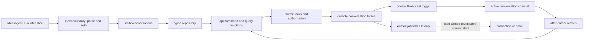

# Database v2 Conversation Primitive implementation plan

- **Status:** approved — implementation pending
- **Prepared:** 2026-07-14
- **Approved:** 2026-07-14 by Richard
- **Branch:** `codex/redesign-v2`
- **Depends on:** Foundation checkpoint `b8d4a5b` and remediation checkpoint
  `842c7d4`
- **Contract:** [Database v2 contract](database-v2-contract.md)
- **Test inventory:**
  [Conversation Primitive test inventory](database-v2-conversation-test-inventory.md)

## Goal

Make one durable, secure, and reusable two-person conversation primitive for
both accepted Help interactions and accepted Connections. After this slice,
the database and application boundary can create a direct or Ask conversation,
append an idempotent message, page and catch up message history, advance read
cursors, and deliver authorized Realtime invalidations without relying on the
legacy `ask_threads`, `direct_message_threads`, polymorphic legacy message
columns, or service-role access from member code.

This is the backend primitive that Help and the redesigned Messages UI will
consume. It deliberately does not port the full inbox or thread screens yet.

## Canonical sources

Use this precedence when details disagree:

1. [ADR 0015](../decisions/0015-prelaunch-v2-database-reset.md);
2. the [database v2 contract](database-v2-contract.md);
3. [`FLOWS.md`](../experience/ui/design-system/handoff/bridgecircle/project/uploads/FLOWS.md)
   §§3, 5, 7c, and 8;
4. ADR 0011's Connect/Ask gating and one-Messages-surface decisions;
5. current code only as evidence of behavior that must be deliberately kept or
   replaced.

Current Supabase guidance recommends private Broadcast with database triggers
over Postgres Changes for scalable database-change subscriptions. The
implementation must follow the current official
[database-change subscription](https://supabase.com/docs/guides/realtime/subscribing-to-database-changes)
and [Realtime Authorization](https://supabase.com/docs/guides/realtime/authorization)
contracts, not copy the legacy `postgres_changes` client.

## Slice specification

### Member outcome

- accepting a Connection creates or reuses the pair's one direct conversation
  and records one idempotent origin line;
- accepting a direct Ask or offer creates one Ask conversation, one origin
  line, and the required opening message in the same transaction;
- participants can retain history after disconnecting, but a direct
  conversation becomes read-only until they reconnect;
- an accepted Ask conversation remains an ordinary sendable conversation after
  the Ask is resolved;
- blocking immediately prevents new durable messages, hides existing history,
  and invalidates the live thread;
- retries cannot duplicate a conversation, system line, user message,
  notification job, or read-cursor advance;
- reconnecting after a WebSocket interruption fills any gap from Postgres.

### Surfaces touched

- `app/supabase/migrations/20260713231344_v2_init.sql`;
- a new focused pgTAP file and concurrency/Realtime harnesses under
  `app/supabase/tests/` and `app/scripts/`;
- `app/src/db/repositories/conversations.ts` plus its parser tests;
- `app/src/db/realtime/conversation-channel.ts` plus its adapter tests;
- `app/src/lib/conversations/` contracts and framework-agnostic operations;
- generated `app/src/db/database.types.ts`;
- a focused `tsconfig.v2-conversations.json` and package verification command;
- the v2 contract, migration/Realtime runbooks, this plan, and its test
  inventory.

Existing Help acceptance and Connection-response SQL functions are touched
only where they create a conversation or race with block/disconnect. Their
member-facing routes and screens remain outside this slice.

### Data-model changes

The existing `conversations`, `messages`, and `conversation_reads` tables stay.
No participant join table is added because the approved Phase 1 primitive is
strictly two-person and the canonical `user_a_id` / `user_b_id` pair is both
simpler and faster.

Add to `public.messages`:

| Column | Contract |
|---|---|
| `system_event_type` | nullable text; required only for system rows |
| `system_event_key` | nullable text; required only for system rows and unique within a conversation |
| `system_actor_user_id` | nullable user FK with `on delete set null`; optional for system rows |

Keep `body` non-null as a short, accessible fallback for system rows. User rows
require `sender_user_id` + `client_nonce` and forbid system fields. System rows
require `system_event_type` + `system_event_key`, forbid sender/nonce, and may
carry an actor. Initial system types are `connection_accepted`, `ask_accepted`,
and `ask_resolved`; later domains add types through explicit migrations.

Add `private.conversation_typing_limits`, containing only conversation ID,
user ID, last state, and last-send timestamp. It bounds the server-checked
typing signal to one event per participant per second and contains no text,
keystrokes, or presence history. It is private, RLS-enabled, and inaccessible
through the Data API.

Correct the read-cursor foreign key so deleting an individual message can set
only `last_read_message_id` to null without trying to null the non-null
`conversation_id`. Message deletion remains unavailable to member roles.

Do not add a duplicated `last_message_id`, participant table, message edit
state, attachment table, or partitioning. The existing pair indexes and unique
`(conversation_id, id)` index are enough for this slice; EXPLAIN gates decide
whether any redundant timestamp index should be removed.

### Out of scope

- the Messages list, Waiting-on-you group, filters, context rail, responsive
  thread UI, read-receipt UI, and typing indicator UI;
- Help creation, matching, offer browsing, decline, expiry, reminder, and
  resolve interfaces beyond their conversation-creation seam;
- People/Profile Connection screens beyond the acceptance transaction seam;
- group chat, attachments, reactions, message edits/deletes, full-text message
  search, online status, last-seen, voice/video, or calendar integration;
- an email cadence or generic outbox-worker implementation;
- compatibility types or adapters for legacy thread tables;
- any remote Supabase command, deployment, push, or merge to `main`.

## Current repo evidence and gaps

At planning time, `codex/redesign-v2` is clean at `842c7d4`, zero commits
behind and eight ahead of local `main`. Foundation has 209 passing pgTAP
assertions and zero focused TypeScript errors. The full compiler remains a
deliberate port inventory of 1,257 errors across 98 legacy files; this slice
must not hide those errors with compatibility types or suppressions.

The v2 baseline already has a strong base:

- one `public.conversations` table with direct-pair uniqueness scoped to
  `kind = 'direct'` and Ask uniqueness scoped to `ask_id`;
- immutable user/system messages with per-sender client nonces;
- one monotonic `conversation_reads` row per user and conversation;
- block-aware read policies and service-free authenticated message commands;
- transactionally created Ask conversations and an outbox job per message;
- indexes for both participant list directions and message/read foreign keys.

The audit found these gaps to close before downstream domains depend on it:

1. `send_message` performs select-then-insert idempotency, so simultaneous
   retries can still collide on the unique nonce.
2. the same helper controls both viewing and sending, so a disconnected pair
   can currently continue sending direct messages.
3. block, disconnect, send, direct-conversation creation, and acceptance do not
   share one lock order, leaving race windows and future deadlock risk.
4. Connection acceptance creates a connection but not the conversation/origin
   line promised by the canonical flow.
5. system messages have no structured event type or idempotency key.
6. the composite read-cursor FK's current delete action can attempt to null a
   non-null key column.
7. read receipts require the other participant's cursor, but the current raw
   policy exposes only the owner's row and there is no bounded projection.
8. history reads have no fixed paginated API and the legacy app loads complete
   threads or every message for every listed conversation.
9. legacy Realtime streams full Postgres rows through Postgres Changes; it has
   no gap-recovery contract and does not implement typing safely.
10. raw conversation tables are selectable by authenticated clients even
    though fixed projections can expose a smaller, more stable surface.
11. the legacy member pipeline uses service-role thread creation, N+1/bulk
    over-fetch patterns, per-message `read_at`, and two separate thread UIs.

## Target pipeline



The command path has one database transaction. Realtime and external delivery
are downstream effects; neither is allowed to decide whether the durable
message exists.

## Architecture decisions

### 1. Conversations are person-scoped; origins keep their own gates

`conversations`, `messages`, reads, blocks, and Connections use user IDs and
outlive an organization membership. Ask provenance remains on `organization_id`
and `ask_id`. The same people may have one direct conversation plus multiple
Ask conversations.

No generic "conversation membership" abstraction is added. The two-person
shape is enforced by canonical user columns and database checks.

### 2. Viewing and sending are different permissions

Replace ambiguous authorization with two explicit helpers:

| State | View history | Send |
|---|---:|---:|
| active participants, direct, connected | yes | yes |
| active participants, direct, disconnected | yes | no |
| active participants, accepted Ask, including after resolution | yes | yes |
| either direction blocked | no | no |
| caller account inactive | no | no |
| counterpart inactive/deleted | retained history with tombstone identity | no |
| non-participant or missing conversation | no | no |

Use `private.can_view_conversation(id)` for RLS and private-channel receipt.
Use an internal send-state check for commands so `connection_required` can be
returned without weakening the non-participant/blocked `not_available` result.

### 3. All pair mutations use one lock order

Add an unexposed `private.lock_user_pair(a, b)` helper. Every operation that
can race for a pair follows this order:

1. read only enough immutable identifiers to find the pair;
2. lock both `public.users` rows in ascending UUID order;
3. lock the root request/Ask/conversation row;
4. lock dependent offers in ascending UUID order where applicable;
5. mutate durable state and enqueue work;
6. commit before any external call.

Retrofit this order into message send, block/unblock, disconnect, direct
conversation creation, Connection acceptance, direct-Ask acceptance, and offer
acceptance. This produces two valid race outcomes: a send commits before a
block/disconnect, or it waits and is denied after the block/disconnect. It must
never commit through a state change that won the lock first.

### 4. Database constraints own idempotency

- direct creation uses `insert ... on conflict` on the partial direct-pair
  unique index;
- Ask creation continues to use unique `ask_id`;
- user send uses one atomic nonce insert and selects the durable winner on
  conflict;
- system lines use unique `(conversation_id, system_event_key)`;
- Connection/Ask retry paths return the existing conversation;
- outbox dedupe remains keyed by the durable message ID;
- read cursors use a conditional UPSERT and advance only to a greater message
  ID.

No application `select → if absent → insert` sequence is treated as a lock.

### 5. Accepted interactions never start as empty implementation artifacts

Connection acceptance creates/reuses the direct conversation and inserts one
`connection_accepted` system line. It does not copy the request intro into a
new user message; the intro remains request provenance rather than a
manufactured chat send.

Direct-Ask and offer acceptance create one `ask_accepted` system line followed
by the accepting side's required opening user message. Both rows and the Ask
transition commit together. Stable event keys make all three paths safe to
retry.

### 6. Fixed query functions replace raw member-table reads

Authenticated roles lose raw `SELECT` on conversations, messages, and read
cursors. RLS stays enabled as defense in depth. Member reads go through:

- `api.get_conversation_detail(conversation_id)`;
- `api.list_conversation_messages_before(conversation_id, before_id, limit)`;
- `api.list_conversation_messages_after(conversation_id, after_id, limit)`.

The detail projection returns the conversation origin, safe counterpart
identity, current sendability, the viewer's read cursor, the counterpart's
read cursor, and latest message ID. Conversation participants receive only a
bounded name/avatar identity after shared membership ends; organization-only
profile fields still require their normal visibility rules. Deleted accounts
map to a tombstone. Blocked/non-participant/missing rows all return no result.

Message projections expose immutable render fields. A client nonce is returned
only to its sender for optimistic reconciliation. System event keys remain
internal.

### 7. Pagination is keyset-only

History pages use `message.id` cursors and a bounded limit of 1–100. Older
history returns rows below `before_id` in descending order; the repository
reverses each page for chronological rendering. Gap recovery returns rows
above `after_id` in ascending order and loops while a full page is returned.

No OFFSET and no full-history load are permitted. Because sends on one
conversation serialize on its row, message ID is the stable order within that
conversation.

### 8. Read state is one monotonic cursor

`api.mark_conversation_read` requires a real message in that conversation. It
creates a cursor or advances it with `greatest`; a lower/equal retry returns
`unchanged` and does not rewrite `last_read_at`. Empty conversations need no
read row.

The other participant sees only the counterpart cursor through the detail
projection. The UI later renders "Read" only against the latest applicable
outgoing message; there is no per-message mutable `read_at` and no last-seen.

### 9. Realtime is an authorized hint, never the source of truth

Use one private channel topic per open thread:

```text
conversation:<conversation_uuid>
```

Database triggers send minimal private events through `realtime.send`:

| Event | Payload |
|---|---|
| `message.created` | conversation ID + message ID |
| `read.advanced` | conversation ID + reader user ID + cursor message ID |
| `conversation.permissions_changed` | conversation ID only |
| `conversation.revoked` | conversation ID only |
| `typing.changed` | conversation ID + actor user ID + boolean + expiry |

Message bodies, client nonces, profile fields, Ask text, and block initiator are
never broadcast. On `message.created`, subscription/reconnection, channel
error recovery, or an ID gap, the client fetches durable rows after its last
seen ID. Duplicate or missing broadcasts therefore cause at most a refetch,
not a missing or duplicated message.

The `realtime.messages` SELECT policy validates the topic through an
empty-search-path security-definer helper and the same block-aware view rule.
No authenticated INSERT policy is granted. Typing is published through
`api.publish_conversation_typing`, which rechecks access on every call,
rate-limits in the private table, and then calls `realtime.send`. This avoids
trusting cached channel-write authorization after a block.

The app calls `setAuth()`, opens only the active conversation channel, removes
it on unmount/navigation, and gives typing a local expiry so a lost stop event
cannot leave a permanent indicator. Presence is not used.

Remove `public.messages` from the Postgres Changes publication and remove its
`replica identity full`; `notifications` remains unchanged in this slice.
Create no custom table/function/index inside Supabase's managed `realtime`
schema—only the supported RLS policy on `realtime.messages`.

### 10. Message commit and delivery work are failure-isolated

One successful new user-message transaction:

1. commits the immutable message;
2. updates last activity through the existing trigger;
3. enqueues exactly one ID-only `create_notification` outbox job;
4. emits the database Broadcast only after commit.

A duplicate nonce returns the original message and creates no second outbox
job or Broadcast. External email and generic outbox consumption stay outside
the transaction and outside this slice. The later consumer must re-read
current block/account/read state before materializing a notification; the job
payload is not authorization.

### 11. `/lib` owns behavior; `/db` owns Supabase

Add framework-agnostic contracts and operations under `src/lib/conversations`:

- `contracts.ts` — repository interface and stable domain result unions;
- `getConversation.ts`;
- `listMessages.ts`;
- `getOrCreateDirect.ts`;
- `sendMessage.ts`;
- `markRead.ts`;
- `publishTyping.ts`.

Add the only Supabase calls under `src/db`:

- `repositories/conversations.ts` — RPC calls and Zod response validation;
- `realtime/conversation-channel.ts` — private-channel lifecycle and event
  parsing.

No Next.js import, redirect, cache call, service-role client, raw table write,
or user-facing copy belongs in `/lib`. The later route/actions will only parse
input, require a session, call these operations, and map stable results.

### 12. Expected states are data, unexpected failures are errors

Recommended command result codes:

| Command | Expected results |
|---|---|
| create direct | `ready`, `connection_required`, `not_available` |
| send | `sent`, `duplicate`, `connection_required`, `invalid_message`, `not_available` |
| mark read | `advanced`, `unchanged`, `invalid_cursor`, `not_available` |
| typing | `published`, `throttled`, `not_available` |

`not_available` deliberately collapses missing, non-participant, blocked, and
inactive-caller states. Repositories throw only for transport failures,
malformed server responses, or violated database invariants. Logs/Sentry may
include the stable code and opaque IDs but never message bodies, profile
content, typing payloads, or block initiator.

## Detailed implementation plan

Each numbered step is an atomic red/green change intended to remain small
enough to review independently. Implementation stops whenever its verify gate
fails.

### Milestone 0 — Freeze the slice and make failures visible

1. [ ] Compare `codex/redesign-v2` with local `main`; merge `main` only if it
   advanced, then rerun the Foundation gate.
   **Verify:** branch relationship recorded; Foundation remains green.
2. [ ] Record Node, pnpm, Supabase CLI, Postgres, migration count, pgTAP count,
   and full TypeScript error/file inventory.
   **Verify:** this plan's implementation record contains reproducible values.
3. [ ] Create `tsconfig.v2-conversations.json` from the Foundation config and
   add only the new conversation `/lib`, `/db`, and direct test importers.
   **Verify:** the declared slice and legacy exclusions are explicit.
4. [ ] Add `009_conversation_primitive.test.sql` with failing function,
   constraint, grant, RLS, result-code, and lifecycle assertions.
   **Verify:** failures correspond only to planned changes.
5. [ ] Add failing parallel-nonce, block-vs-send, disconnect-vs-send,
   read-cursor, and direct-create harness cases.
   **Verify:** at least the known nonce/race behavior fails before the fix.
6. [ ] Add a failing local Realtime harness for authorized delivery, denied
   third-party join, gap fill, and channel cleanup.
   **Verify:** legacy Postgres Changes cannot satisfy the new private-Broadcast
   contract.

### Milestone 1 — Harden the relational contract

7. [ ] Add structured system-event columns, FK, shape checks, allowed-type
   check, and the partial event-key unique index.
   **Verify:** malformed user/system shapes and duplicate event keys fail.
8. [ ] Correct the composite read-cursor FK delete action.
   **Verify:** deleting a referenced fixture message nulls only the cursor and
   leaves the read row valid.
9. [ ] Add the private typing-limit table, RLS, constraints, and both FK
   indexes.
   **Verify:** it is absent from Data API/generated schemas and direct roles.
10. [ ] Add `private.lock_user_pair` with ascending lock order and no client
    execute grant.
    **Verify:** pgTAP confirms privilege denial and the concurrency harness can
    hold/release the pair deterministically.
11. [ ] Replace ambiguous access logic with explicit view and send helpers.
    **Verify:** every row in the access matrix passes for both directions.
12. [ ] Add safe topic parsing/authorization without direct casts that can
    raise on malformed topics.
    **Verify:** valid participant topic succeeds; malformed, blocked, and
    non-participant topics return false without error.
13. [ ] Review the message index budget against the exact before/after and FK
    queries; remove a redundant index only with EXPLAIN evidence.
    **Verify:** every FK retains a leading index and accepted queries use an
    index scan.

### Milestone 2 — Make creation and send transactions race-proof

14. [ ] Add an idempotent private system-message insertion helper.
    **Verify:** repeated event key returns the same durable row.
15. [ ] Refactor direct conversation creation to lock the pair and use the
    partial unique index as the arbiter.
    **Verify:** parallel callers receive one conversation ID.
16. [ ] Refactor Connection acceptance to pair-lock, request-lock, create the
    connection, ensure the conversation, and insert one origin line.
    **Verify:** one retry returns the same connection/conversation with one
    system event and one notification job.
17. [ ] Retrofit direct-Ask acceptance to pair-lock before its Ask lock and
    insert origin + opening rows atomically.
    **Verify:** a failed opening insert rolls back Ask, conversation, messages,
    events, and outbox together.
18. [ ] Retrofit offer acceptance to pair-lock, Ask-lock, and offer-lock in
    stable order before creating origin + opening rows.
    **Verify:** simultaneous accepts still produce one accepted offer and one
    conversation without deadlock.
19. [ ] Refactor block/unblock and disconnect to acquire the same pair lock
    before mutating relationship state.
    **Verify:** existing safety invariants and audit assertions remain green.
20. [ ] Rewrite user-message insertion around one atomic nonce conflict path.
    **Verify:** 20 parallel identical sends yield one message ID.
21. [ ] Enqueue notification work only when the message insert wins.
    **Verify:** the 20-send retry test yields one outbox job with no body.
22. [ ] Return stable send/create result rows instead of expected-state SQL
    exceptions.
    **Verify:** blocked/non-participant/missing collapse to `not_available`;
    disconnect returns `connection_required` only to a participant.
23. [ ] Keep the sender-validation trigger as defense in depth and align it
    with the new send helper.
    **Verify:** privileged fixture attempts still cannot insert a user message
    from a non-participant or blocked pair.

### Milestone 3 — Add bounded reads and monotonic receipts

24. [ ] Add the conversation-detail projection with bounded counterpart
    identity and both read cursors.
    **Verify:** participant, disconnected, tombstone, blocked, and outsider
    personas receive exactly the approved shape.
25. [ ] Add older-history keyset query with a 1–100 limit and no OFFSET.
    **Verify:** page boundaries have no duplicate rows and EXPLAIN uses the
    conversation/message index.
26. [ ] Add after-cursor gap query in ascending order.
    **Verify:** more than 100 missed rows can be drained in bounded pages.
27. [ ] Replace read marking with a conditional monotonic UPSERT.
    **Verify:** concurrent out-of-order cursor writes finish at the greatest
    message ID and lower retries do not change `last_read_at`.
28. [ ] Expose the counterpart cursor only through the detail projection.
    **Verify:** raw cursor/table SELECT is denied while the participant receipt
    remains visible.
29. [ ] Revoke authenticated raw SELECT on the three conversation tables and
    grant only the fixed API functions.
    **Verify:** direct Data API reads fail for authenticated/anon; service role
    and pgTAP fixtures retain required maintenance access.

### Milestone 4 — Replace row streaming with private invalidation

30. [ ] Add the narrow Realtime SELECT policy on `realtime.messages` using the
    safe topic helper; add no client INSERT policy.
    **Verify:** only active, unblocked participants can join a private topic.
31. [ ] Add an after-insert message trigger that sends only conversation and
    message IDs through `realtime.send`.
    **Verify:** one committed new message produces one `message.created`; a
    rolled-back or duplicate send produces none.
32. [ ] Add a conditional read-cursor trigger for `read.advanced`.
    **Verify:** unchanged/lower cursor calls do not broadcast.
33. [ ] Broadcast permission-change/revocation invalidations from disconnect
    and block transactions.
    **Verify:** an already-open participant channel receives the event, then
    the next send/join is denied as appropriate.
34. [ ] Add rate-limited `api.publish_conversation_typing` and minimal payload.
    **Verify:** access is rechecked per call; repeat calls throttle; no typing
    content is stored.
35. [ ] Remove messages from the Postgres Changes publication and remove
    message replica-identity expansion.
    **Verify:** publication inventory contains no `public.messages`; private
    Broadcast still delivers.
36. [ ] Build the client channel adapter with `setAuth`, private topic config,
    Zod event parsing, refetch callbacks, typing expiry, and cleanup.
    **Verify:** unit tests reject malformed/spoofed payloads and remove exactly
    one channel on teardown.
37. [ ] Complete the two-client local Realtime harness, including reconnect gap
    recovery and a denied outsider.
    **Verify:** durable API results converge even when one Broadcast is ignored.

### Milestone 5 — Establish the application boundary

38. [ ] Define conversation entities, cursors, repository interface, and
    stable result unions in `/lib`.
    **Verify:** no framework, Supabase, or transport import appears there.
39. [ ] Implement the repository's conversation detail and page parsers with
    exact Zod schemas.
    **Verify:** malformed/nullability-drift fixtures fail loudly.
40. [ ] Implement repository command mappings for create/send/read/typing.
    **Verify:** every expected database result maps to one domain union and
    unknown results throw.
41. [ ] Implement small `/lib` operations using injected repository methods.
    **Verify:** Vitest covers success, retry, expected denial, and unexpected
    dependency failure without a database.
42. [ ] Add a static boundary check forbidding legacy thread identifiers,
    service clients, and raw conversation table calls in the new modules.
    **Verify:** the check fails on a deliberate fixture violation and passes on
    the implementation.
43. [ ] Run the focused conversation typecheck and Vitest suite.
    **Verify:** zero errors and no suppression/compatibility types.

### Milestone 6 — Rebuild, audit, and checkpoint

44. [ ] Reset the local database from empty and run all pgTAP files serially.
    **Verify:** every Foundation and Conversation assertion passes.
45. [ ] Run nonce/pair-lock/read-cursor concurrency harnesses serially after
    pgTAP.
    **Verify:** no duplicate rows, lock leaks, timeouts, or deadlocks.
46. [ ] Run local Realtime integration after the database gates.
    **Verify:** private delivery, denial, revocation, cleanup, and gap recovery
    pass without exposing message text in events.
47. [ ] Run warning-level database lint, empty schema diff, grant/RLS/FK/index
    audits, and targeted EXPLAIN plans.
    **Verify:** no warning or unexplained sequential scan remains.
48. [ ] Generate `public` + `api` types twice and compare byte-for-byte.
    **Verify:** deterministic output and no `private`/`realtime` schema leak.
49. [ ] Re-run Foundation + Conversation focused TypeScript/Vitest and the
    global compiler inventory.
    **Verify:** both completed slices are zero-error; every global change is
    classified and no out-of-slice drift appears.
50. [ ] Update the v2 contract, active implementation sequence, test inventory,
    migration/Realtime runbooks, and ADR status together.
    **Verify:** docs describe Broadcast, access states, APIs, and remaining
    legacy domains consistently.
51. [ ] Audit staged additions for secrets, message bodies in telemetry,
    service-role leakage, broad grants, raw IP/token logging, unbounded queries,
    and unrelated files.
    **Verify:** clean `git diff --check`, zero secret-pattern hits, exact file
    inventory.
52. [ ] Commit one Conversation Primitive checkpoint.
    **Verify:** clean worktree; no push, merge, deployment, or remote database
    command occurred.

## Verification gates

The slice is complete only when all of these are green:

- local reset from the single v2 baseline;
- all pgTAP, including the new Conversation file;
- deterministic parallel create/send/read/block/disconnect tests;
- private Realtime integration with two participants and one outsider;
- warning-level lint and empty schema diff;
- every FK indexed and every member grant explicitly allowlisted;
- targeted EXPLAIN index scans at realistic synthetic volume;
- deterministic two-pass type generation;
- Foundation and Conversation focused TypeScript/Vitest at zero;
- global compiler drift classified with no unexplained out-of-slice error;
- static ban on legacy thread identifiers and service clients in new modules;
- no secret, message body, Ask text, typing content, or block initiator in logs,
  Broadcast payloads, or outbox payloads;
- no remote state change.

## Stop conditions

Stop and revise the plan before continuing if:

- a requirement needs group-chat membership or more than two participants;
- raw message rows or message bodies would be broadcast;
- a member route requires a service-role client;
- send/block/disconnect cannot share one provable lock order;
- a query requires OFFSET or unbounded message history;
- an expected product state escapes as raw SQL/PostgREST text;
- private-channel access cannot be proven for blocked and outsider personas;
- a Realtime failure can make durable messages disappear from the UI;
- a schema change weakens account deletion or retained-history behavior;
- a local command resolves to a linked/shared Supabase project;
- any Foundation gate regresses.

## Approval decisions

Approval of this plan means approving these choices for the Conversation
Primitive slice:

1. private database Broadcast replaces Postgres Changes for messages;
2. Realtime carries IDs/invalidation only and Postgres remains authoritative;
3. typing is server-checked, throttled, ephemeral, and has no Presence/last-seen;
4. accepted Connections create a direct conversation and structured origin
   line immediately;
5. a Connection request's intro remains request provenance and is not copied
   into the conversation as a manufactured user message;
6. direct history survives disconnect but sending requires a current
   Connection;
7. accepted Ask conversations remain sendable after resolution;
8. conversation reads use fixed API projections, not raw client table access;
9. pair-lock ordering is retrofitted into the minimal existing Help/Connection
   SQL seams needed to eliminate races;
10. no Messages/Help/People UI port, generic outbox worker, remote database
   action, push, or merge occurs in this slice.

After signoff, first commit the accepted plan as its own checkpoint. Then
implement Milestones 0–6 on `codex/redesign-v2`, stopping on the first failed
verify gate.

## Signoff

Richard approved this plan on 2026-07-14. The approval includes all ten
Conversation Primitive choices above and authorizes local implementation and
verification on `codex/redesign-v2`. It does not authorize any remote database
operation, push, merge, deployment, or reset.
