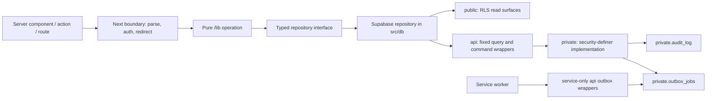

# Database v2 Foundation implementation plan

- **Status:** implemented and verified locally; not deployed
- **Branch:** `codex/redesign-v2`
- **Date:** 2026-07-14
- **Depends on:** [ADR 0015](../decisions/0015-prelaunch-v2-database-reset.md) and the [database v2 contract](database-v2-contract.md)
- **Scope:** local schema and application port only; no shared-development or production mutation

## Goal

Make BridgeCircle's identity, organization, membership, self-profile, and
onboarding paths run correctly against the v2 database while preserving the
database-enforced tenant, privacy, blocking, audit, and reliability rules that
later Help, Messages, People, and School work will depend on.

At the end of this milestone, a locally invited member can create an account,
accept an invite atomically, complete profile setup, select the correct circle,
and enter the redesigned app shell. Pending, revoked, cross-organization, and
blocked personas cannot obtain data or perform commands outside their scope.

This is a backend-foundation milestone. It does not implement the redesigned
Help, Messages, People, or School domains.

## Current evidence

As of 2026-07-14:

- the clean v2 baseline, deterministic seed, and generated `public` + `api`
  types are present on `codex/redesign-v2`;
- the current local baseline has 209 passing pgTAP assertions;
- the baseline has RLS, a centralized grant section, composite tenant foreign keys,
  supporting foreign-key indexes, block-aware helpers, audit storage, and an
  outbox claim primitive;
- the Foundation application boundary uses the v2 contract; later product
  domains remain deliberately unported;
- `pnpm typecheck:v2-foundation` passes with zero errors;
- the full `pnpm tsc --noEmit` migration inventory is 1,257 errors across 98
  legacy files, down from the initial 1,356 errors across 108 files;
- those errors are the port inventory, not permission to weaken types or add
  an untyped client;
- the active local database may be destroyed and rebuilt, but neither shared
  Supabase project is authorized for reset or migration repair.

## Sources and precedence

1. [ADR 0015](../decisions/0015-prelaunch-v2-database-reset.md)
2. [Database v2 contract](database-v2-contract.md)
3. Approved redesigned behavior in
   [`FLOWS.md`](../experience/ui/design-system/handoff/bridgecircle/project/uploads/FLOWS.md)
4. Current code for behavior not yet superseded by those sources
5. Phase 1 spec and launch-cut documents for remaining product intent

When code and the approved target disagree, the implementation changes the
code and updates the active docs in the same slice. Accepted ADRs are not
silently rewritten.

## Implementation record

Milestones 0–6 completed locally on 2026-07-14:

- approved plan checkpoint: `aa701c8` on `codex/redesign-v2`;
- toolchain: Node `22.22.2`, pnpm `10.33.2`, Supabase CLI `2.109.1`;
- migration inventory: one active v2 baseline and 27 archived legacy files;
- Docker preflight: the running local stack is named `supabase_*_bridgecircle`;
- compiler baseline: 1,356 errors across 108 files globally; the initial
  Foundation gate narrows the active slice to 223 errors across 20 files;
- local database reset from legacy history to the v2 baseline completed;
- security red phase failed only on the five intended grant/membership-policy
  assertions;
- security green phase passes all 86 pgTAP assertions, warning-level lint,
  empty `public,api,private` shadow diff, static Data API/type boundaries, and
  two-pass deterministic generated types;
- member context, safe service-only invite verification, locked atomic invite
  acceptance, and same-organization membership decisions now pass 45 added
  pgTAP assertions;
- the forced two-connection acceptance contract holds the first transaction's
  invite lock while the second caller retries, producing one membership, one
  organization profile, one accepted invite, and one audit event;
- the owner-only self-profile projection and seven atomic profile/onboarding
  commands pass 43 added assertions, including pending-member resume and the
  explicit active-only-helper versus pending-command distinction,
  invalid-aggregate rollback, path-scoped avatar persistence, and idempotent
  profile-index enqueue;
- overlapping experience/skills replacements serialize on the membership lock
  and preserve one complete aggregate rather than a mixed child set;
- the Milestone 3 rebuild passes all 172 assertions, warning-level lint, an
  empty schema diff, static boundary checks, and identical two-pass generated
  types;
- symmetric block enforcement now covers profile, organization-profile,
  helper, connection, Help, conversation, and message surfaces through the
  centralized helper;
- every Foundation profile mutation writes an exact non-PII audit action, and
  repeated account pseudonymization does not duplicate its audit or Storage
  deletion side effects;
- service-only outbox claim/complete/retry/fail wrappers enforce lock
  ownership, stale-lock recovery, attempt caps, and durable terminal states;
- two overlapping outbox workers claim three disjoint jobs each through
  `FOR UPDATE SKIP LOCKED`;
- typed repositories now own every Foundation Supabase call while invite,
  profile, membership, and admin orchestration stays framework-agnostic;
- password signup and OAuth invite acceptance, the secure membership cookie,
  deterministic circle chooser, member layout, notifications, onboarding,
  avatar-path persistence, pending state, and approval command use v2
  projections and commands;
- the focused compiler gate passes with zero errors, and 22 Vitest assertions
  across nine files cover result parsing and pure orchestration;
- four local-only Playwright scenarios cover invite/signup/onboarding/shell,
  pending-to-approved access, explicit multi-circle selection, and rejection
  of a foreign membership cookie; the core scenario also proves avatar
  upload/path/re-render and persisted notification acknowledgement, with
  browser error capture enabled;
- the final full compiler inventory is 1,257 errors across 98 legacy files,
  with no error in the completed Foundation slice;
- hosted Supabase advisors are deferred to the separately approved remote
  cutover because they operate on hosted projects; local warning lint, grant,
  RLS, foreign-key/index, pgTAP, schema-diff, and deterministic-type gates are
  green;
- no shared-development or production database was read, changed, or reset.

## Post-implementation review remediation

- **Status:** approved through Richard's 2026-07-14 request and implemented in
  this follow-up slice
- **Goal:** remove documentation ambiguity that could cause a later domain to
  weaken pending onboarding, multi-circle routing, privacy, or verification
- **Surfaces:** the v2 contract, Foundation plan/test inventory, active Phase 1
  notices, ADR 0015 status, migration/E2E runbooks, the pgTAP regression suite,
  and the static Supabase boundary checker
- **Data model:** no new table, column, policy, function, grant, or migration;
  the implemented SQL behavior remains authoritative
- **Out of scope:** private-avatar conversion, a new rate-limit provider,
  remote Supabase work, merging `main`, or porting the next product domain

Remediation plan:

1. [x] Correct the active-only ownership-helper wording and add regression
   coverage proving pending onboarding commands remain available.
2. [x] Add the implemented member-context and Foundation function contracts to
   the higher-precedence database contract.
3. [x] Record exact chooser behavior, account-global unread behavior, and the
   public-avatar exposure tradeoff.
4. [x] Define compiler-slice accounting, the public-join abuse-control gate,
   and the long-lived branch synchronization cadence.
5. [x] Make the static boundary checker fail closed when `rg` is unavailable.
6. [x] Re-run the affected pgTAP/static checks, the full local database suite,
   lint/diff, and documentation audit; then commit one remediation checkpoint.

The review's earlier uncommitted-work concern was stale by the time this slice
started: `b8d4a5b` already contains the 75-file Foundation checkpoint and the
worktree was clean. No intermediate recovery commit is needed.

## Scope

### In scope

- Supabase Auth shadow-user triggers;
- account-state reads needed for routing;
- organizations and membership lifecycle primitives;
- invite verification and atomic invite acceptance;
- deterministic multi-organization context selection;
- self-profile and organization-profile reads;
- staged onboarding writes for profile, education, experience, skills, helper
  availability, helper topics, and freshness consent;
- profile completion and avatar-path persistence;
- admin approval/rejection primitives required to test pending membership;
- the central block/unblock contract;
- audit writes for every Foundation state transition;
- outbox claim, complete, retry, and terminal-failure primitives for the
  service worker;
- notification list/unread summary and mark-read command needed by the member
  shell;
- typed repositories, pure business functions, server boundaries, local
  fixtures, pgTAP, Vitest, and focused Playwright coverage.

### Explicitly out of scope

- direct/circle Ask behavior, offers, matching, or reminders;
- conversation and message migration beyond the shell's notification summary;
- other-member profile projections, search, connections UI, or embeddings;
- School, events, announcements, analytics, or full admin UI migration;
- account-export generation;
- the redesigned email-confirmed 30-day account-deletion orchestration;
- remote development or production reset, migration repair, deployment, or
  secret/configuration changes;
- a legacy database compatibility schema, dual writes, `any`-typed Supabase
  client, hand-edited generated types, or broad service-role use.

The existing idempotent pseudonymization routine and Auth-delete trigger stay
covered by database tests. The member-facing deletion request/confirmation
workflow is implemented with Settings/account lifecycle later, when its email
token and 30-day behavior can be completed end to end.

## Decisions for this milestone

### 1. Keep the database as the authority for invariants

Expected product errors may be mapped to stable result codes. Tenant,
ownership, lifecycle, and concurrency rules remain in SQL. The application
does not duplicate those rules and then hope every caller remembers them.

### 2. Use API commands for every member-controlled Foundation table write

Member roles receive no raw INSERT, UPDATE, or DELETE access to Foundation
tables. Writes go through fixed-signature `api` functions backed by
empty-search-path `private` implementations. Service-role operations also use
explicit `api` wrappers rather than raw multi-table writes from `/lib`. Auth
triggers and owner-scoped Storage uploads remain their existing, separately
tested boundaries.

### 3. Make grants allowlist-based

Replace `grant execute on all functions in schema api to authenticated` with
an explicit function list. Do not grant authenticated users blanket sequence
access. The exposed `api` wrappers remain security-invoker functions; only
their exact private implementations and the exact helpers used by RLS receive
narrow authenticated EXECUTE grants. `private` remains absent from the Data
API schemas and generated client types. A new service-only function must be
unreachable to `anon` and `authenticated` unless its grant is deliberately
added and tested.

### 4. Make invite acceptance one transaction

The current application creates membership/profile rows, updates the invite,
and writes audit state through separate admin-client calls. V2 replaces that
with one idempotent command that locks the invite and performs all changes or
none.

### 5. Select organization context explicitly

Never use `.limit(1)` as organization selection. An HTTP-only
`bc_membership_id` cookie identifies the preferred membership. The Next.js
boundary passes that UUID to the context RPC; the database—not the cookie—then
validates that it belongs to the current user and is active or pending.

Without a valid preference, the database selects the only active membership,
or the only pending membership when there is no active one. It requires the
chooser only when more than one active membership exists, or when there are no
active memberships and more than one pending membership. One active plus any
number of pending memberships fast-paths to the active circle. Rejected and
revoked rows remain visible in the account's context list for correct routing,
but are not selectable.

The cookie is a preference, not authorization. The database validates its
membership ID on every context read.

The context projection's unread count is deliberately account-global across
all organizations. The shell therefore shows one total badge even while one
circle is selected; per-circle filtering is deferred unless multi-circle use
shows that the global badge is confusing.

### 6. Keep normalized profile children normalized

Career, education, and skills are replaced transactionally through profile
commands. The application does not rebuild legacy JSON columns or maintain a
second profile representation.

### 7. Pull only true onboarding dependencies forward

Onboarding already asks for helper availability/topics and freshness consent.
The narrow commands needed to persist those values land in Foundation so the
flow is not rewritten twice. Full Help settings, matching, and enrichment
processing remain in their later domains.

### 8. Do not hide the transition with compatibility types

The integration branch remains intentionally non-mergeable while unported
domains reference the legacy contract. Foundation gets a focused TypeScript
configuration and focused tests. Each later domain declares its focused files
and direct importers before work begins. The raw global error count may move
temporarily when a shared contract reveals legitimate importer failures, but
every new error must be classified to that active slice and the slice must be
green at its checkpoint. No unexplained out-of-slice drift, `@ts-ignore`,
`@ts-nocheck`, legacy `Database` alias, or untyped Supabase client is allowed.

Full `pnpm tsc --noEmit`, build, and E2E become mandatory zero-error gates
before remote development cutover. Until then, the domain-specific green gate
is honest about the long-lived migration branch instead of masking runtime
incompatibility.

### 9. Keep one clean pre-cutover baseline

ADR 0015's one-time exception is still active because the v2 migration has not
been applied to a shared project. Foundation schema changes are folded into
`20260713231344_v2_init.sql`, with tests and generated types changed in the
same slice. A temporary local migration may be used while diagnosing a SQL
change, but it is not retained at the Foundation checkpoint. The baseline
becomes immutable immediately after the approved development cutover; all
later changes use forward-only migrations.

## Target architecture

Responsibilities:

- `src/app`: HTTP/UI wiring, cookies, redirects, and Zod parsing only;
- `src/lib`: framework-agnostic orchestration and stable product results;
- `src/db`: Supabase clients and typed repository implementations;
- `public`: exact RLS-protected relational reads;
- `api`: approved projections and transactional commands;
- `private`: privileged helpers, audit, outbox, and implementation details;
- service worker: external email/Storage work after the database transaction
  commits.

External email, enrichment, AI, and Storage API calls never run while a SQL
lock is held.

## Foundation database contract additions

### Read projections

#### `api.get_my_member_context(p_preferred_membership_id uuid default null)`

Authenticated only. Returns exactly one typed row for the current Auth user,
including:

- account state and onboarding completion;
- validated selected membership ID, or null;
- `requires_circle_choice`;
- account-global unread-notification count across every organization;
- a fixed-shape `memberships` JSON array containing each owned membership's
  status, joined time, organization ID/slug/name/approval mode, self profile
  summary, and current roles.

The query starts from `public.users`, so a valid Auth user with zero
memberships still gets a routable account result with an empty array. The only
input is a membership preference; it never accepts a user ID. The repository
validates the fixed JSON shape with Zod.

#### `api.get_my_profile(membership_id)`

Authenticated owner only. Returns the complete self-edit model for the chosen
membership, including ordered career, education, skills, visibility overrides,
helper preference/topic data, and freshness policy. Nested collections use a
fixed JSON shape and are validated with Zod at the repository boundary.

#### `api.verify_invite(token)`

Service role only. Hashes the raw high-entropy token inside the database and
returns only safe join-page fields. It never returns `token_hash`. The public
join route calls this through the server-only service repository; browser code
does not receive a privileged client.

Both the application and SQL reject tokens outside 32–512 characters before
hash lookup, and invalid states return the same bounded, non-secret result.
That makes token enumeration impractical but does not make an unbounded public
route free. Before public traffic or either remote cutover, BridgeCircle must
add an infrastructure-backed per-IP request limit or challenge at `/join` and
the signup action, verify trusted-proxy header handling, and test the 429 path.
Do not persist raw invite tokens or raw IP addresses to implement that limit.
The existing Supabase Auth limits protect Auth endpoints; they do not by
themselves limit the server-side invite-verification RPC.

### Member commands

#### `api.accept_invite(token)`

Authenticated only. In one transaction:

1. hash and lock the invite row;
2. validate pending status, expiry, and normalized Auth email;
3. resolve approval mode;
4. create or reuse the unique membership;
5. create the organization profile;
6. create the global profile when invite/Auth metadata contains a nonblank
   display name, otherwise leave it for onboarding step 1;
7. mark the invite accepted by the current user;
8. write audit state and enqueue any approved notification/email work;
9. return membership ID, membership status, and a stable result code.

Repeating the same request for the same user returns the durable result. A
different user, email mismatch, expired invite, revoked invite, or already-used
invite produces a stable non-secret result and no partial writes.

#### Profile commands

Use command names based on data responsibility rather than UI component names:

- `api.save_profile_identity` — display/preferred/other name and graduation
  year for an owned membership;
- `api.save_profile_education` — university/major plus ordered normalized
  education rows;
- `api.save_profile_current` — employer/title/city/headline/LinkedIn URL;
- `api.save_profile_history` — ordered experiences and skills;
- `api.save_profile_preferences` — organization bio, helper availability,
  helper topics, and freshness consent;
- `api.set_my_avatar_path` — owner path after a successful Storage upload;
- `api.complete_onboarding` — validate the required floor, timestamp completion,
  audit, and enqueue profile indexing.

Each command:

- derives the user from `auth.uid()`;
- locks the membership row, verifies it belongs to the caller and an active
  account, and then permits lifecycle status `active` or `pending`;
- returns `not_owned` separately from `membership_unavailable` so callers do
  not infer another member's state;
- treats retries idempotently;
- replaces ordered child rows inside one short transaction;
- returns a stable result code for expected product states;
- never accepts `user_id` from the member caller.

#### Membership and safety commands

- `api.decide_membership(membership_id, decision)` — active org admin accepts
  or rejects a pending membership, sets approver/time fields, audits, and
  enqueues the result notification;
- existing `api.block_member` / `api.unblock_member` remain the sole member
  block mutation surface;
- existing `api.mark_notifications_read(notification_ids)` remains the sole
  notification mutation required by the shell;
- blocking continues to affect profile, Help, connection, conversation, and
  message policies through `private.is_blocked`.

### Service-only outbox commands

Add explicit wrappers, granted only to `service_role`:

- `api.claim_outbox_jobs(worker_id, limit)`;
- `api.complete_outbox_job(job_id, worker_id)`;
- `api.retry_outbox_job(job_id, worker_id, error, available_at)`;
- `api.fail_outbox_job(job_id, worker_id, error)`.

Completion and failure verify the lock owner. Retry clears the lock and moves
the job back to `pending`; terminal failure occurs at `max_attempts`. Multiple
workers claim disjoint rows through `FOR UPDATE SKIP LOCKED`. External work
occurs after claim commit and before the short completion/retry command.

### Policy and grant corrections

- let a membership owner read their own pending/rejected/revoked row while
  same-organization browsing still requires an active membership;
- provide pending users only the safe organization context returned by the
  self-context API;
- keep raw profile, invite, audit, outbox, and private-table access revoked;
- keep `private` outside the Data API and generated client contract;
- explicitly grant authenticated execution only to private implementations
  reached by an authenticated API wrapper and helpers required by RLS; deny
  every other private function, including service-only work;
- explicitly grant each authenticated `api` function;
- explicitly grant service-only functions only to `service_role`;
- remove blanket authenticated sequence access unless a reviewed direct-write
  path proves it is needed;
- add pgTAP assertions for every grant and denial.

No new Foundation table is required. If implementation discovers a proposed
table, stop and amend this plan/contract before adding it.

### Query, index, and transaction rules

- `get_my_member_context` is the member-shell bootstrap query. It replaces the
  current repeated user/membership/profile/admin-role/count round trips.
- `get_my_profile` returns the bounded self-edit aggregate once; onboarding
  does not issue one query per education, experience, skill, or helper topic.
- notification rows use the existing `(recipient_user_id, created_at desc,
  id desc)` cursor index; unread count uses the existing unread partial index.
- every membership/RLS join column must have a supporting index. New indexes
  require a named query or constraint and an `EXPLAIN (ANALYZE, BUFFERS)` check
  on representative local data; do not add speculative indexes.
- RLS policies wrap stable Auth/helper calls in scalar `select` form where
  PostgreSQL can initialize them once per statement, while preserving the
  central helper contract.
- every security-definer implementation stays in `private`, uses
  `set search_path = ''`, fully qualified names, and an explicit caller grant
  test. Exposed `api` wrappers stay security-invoker with fixed signatures, in
  accordance with the accepted database contract.
- write commands lock rows in a documented order: root membership/invite first,
  then owned profile rows, then replaceable children. No command waits on an
  external API or starts a second database transaction.
- retries use durable uniqueness or dedupe keys, not a read-then-insert race.
- after each schema slice, run warning-level database lint; after Foundation,
  run Supabase security/performance advisors and disposition every finding.

## Application structure

### Typed database adapters

Create small repository modules rather than a generic data layer:

- `src/db/repositories/member-context.ts`
- `src/db/repositories/invites.ts`
- `src/db/repositories/profiles.ts`
- `src/db/repositories/memberships.ts`
- `src/db/repositories/blocks.ts`
- `src/db/repositories/outbox.ts`

Repositories own Supabase select/RPC syntax and translate generated rows into
domain values. They do not decide product copy or redirects.

### Pure domain operations

Keep or refactor the matching domain modules so they import no Next.js,
Supabase client, or Resend code:

- `src/lib/invite/verify.ts`
- `src/lib/invite/accept.ts`
- `src/lib/profile/savePartialProfile.ts`
- `src/lib/profile/uploadAvatar.ts`
- `src/lib/admin/decideMembership.ts`
- a small member-context selector under `src/lib/auth/` or
  `src/lib/membership/`.

Each receives a narrow repository interface, normalizes expected result codes,
and has Vitest fakes for success, retry, and denial paths.

### Next.js boundary

- move redirect/cookie behavior out of business functions;
- keep auth session extraction and membership-cookie handling in a server-only
  application boundary;
- use the context projection once in the member layout instead of repeating
  users/memberships/profile/admin-role queries;
- add a minimal circle chooser for multiple usable memberships;
- resolve `avatar_path` to a public Storage URL at the boundary; never store a
  signed/public URL in `profiles`;
- port the notification list through owner RLS, bootstrap unread count through
  member context, and mark-read through its command;
- remove `createAdminClient` from invite/profile/member business modules.

### Transition verification

Add `tsconfig.v2-foundation.json` and `pnpm typecheck:v2-foundation`. It includes
the v2 database clients, Foundation repositories and `/lib` modules, join,
callback, onboarding, member layout, circle chooser, shell notification
dependency, and focused tests.

This config is a temporary verification tool, not a second production type
contract. It is deleted when the global typecheck reaches zero errors.

## Implementation plan

Every numbered step is reviewable on its own. Proceed only when its verification
passes; diagnose failures before starting the next step.

### Milestone 0 — Freeze the local contract and verification baseline

1. [x] After signoff, commit the approved planning docs, then record branch, commit,
   dirty state, Node/pnpm versions, and the 1,356-error / 108-file compiler
   baseline.
   **Verify:** `codex/redesign-v2` is current and no unrelated change is present.
2. [x] Confirm active migration history contains only the v2 baseline and legacy
   history is archived.
   **Verify:** migration and archive file lists match ADR 0015.
3. [x] Inspect Docker container names before starting Supabase; do not stop another
   project's stack without approval.
   **Verify:** BridgeCircle ports are free or the conflicting owner is known.
4. [x] Add the focused Foundation typecheck script and initial include list.
   **Verify:** failures are limited to identified Foundation legacy calls.
5. [x] Add the [Foundation test inventory](database-v2-foundation-test-inventory.md)
   mapping each invariant to pgTAP, Vitest, Playwright, or a static boundary
   check.
   **Verify:** every definition-of-done item below has an owning test.

### Milestone 1 — Correct the SQL security boundary first

6. [x] Write failing pgTAP assertions for owner-pending membership reads, explicit
   function grants, raw profile denial, and service-only outbox denial.
   **Verify:** only the new assertions fail.
7. [x] Replace blanket authenticated API/sequence grants with explicit allowlists.
   Grant only the matching private implementations and RLS helpers required by
   those allowed surfaces; keep `private` outside the Data API.
   **Verify:** reviewed API calls and RLS policies work, while non-allowlisted
   API/private functions, sequences, anon, and cross-role calls fail; exposed
   schemas and generated types still omit `private`.
8. [x] Amend membership read policy so owners can read their own non-active row
   without granting organization data to another pending/revoked user.
   **Verify:** active, pending, revoked, cross-org, and anon personas pass.
9. [x] Re-run database lint and the foreign-key/RLS schema contract.
   **Verify:** zero warnings and all existing assertions pass.

### Milestone 2 — Build the context and invite contract

10. [x] Add failing tests for zero, one, multiple, pending, rejected, revoked,
    valid-preference, and tampered-preference context results.
    **Verify:** tests prove no user-ID argument or cross-user row is accepted.
11. [x] Implement `private.get_my_member_context` and its fixed `api` wrapper.
    **Verify:** it returns one account row, validates the preferred membership,
    and produces the deterministic selection/chooser result above.
12. [x] Add failing invite-verification tests for valid, missing, expired, revoked,
    and accepted tokens.
    **Verify:** safe fields only; no hash/raw-table privilege.
13. [x] Implement the service-only invite verification projection.
    **Verify:** service role succeeds; anon/authenticated direct calls fail.
14. [x] Add invite-acceptance tests for auto-approve, pending approval, email
    mismatch, missing display name, repeat acceptance, and competing users.
    **Verify:** tests fail before the command exists.
15. [x] Implement atomic invite acceptance with a locked invite and idempotent
    inserts.
    **Verify:** acceptance tests and deferred constraints pass.
16. [x] Add a concurrent acceptance test.
    **Verify:** one membership/org-profile result, one accepted invite, no
    duplicate profile, and no partial rows.
17. [x] Add `api.decide_membership` with admin, cross-org, and repeat-decision tests.
    **Verify:** only an active same-org permitted admin can decide.

### Milestone 3 — Build the self-profile/onboarding contract

18. [x] Add failing self-profile read tests for owner, cross-user, blocked orgmate,
    pending member, and invalid membership.
    **Verify:** only the owner receives the full edit projection.
19. [x] Implement `api.get_my_profile`.
    **Verify:** ordered children and defaults match the fixed return contract.
20. [x] Add profile-identity command tests, including profile creation when invite
    acceptance had no usable display name.
    **Verify:** non-owner and cross-org writes fail without partial updates.
21. [x] Implement `api.save_profile_identity`.
    **Verify:** global and organization fields commit atomically.
22. [x] Add and implement education replacement tests/command.
    **Verify:** invalid ranges fail; valid ordering is deterministic; retries do
    not duplicate rows.
23. [x] Add and implement current-profile field tests/command.
    **Verify:** URL and length constraints produce stable results.
24. [x] Add and implement experience/skills replacement tests/command.
    **Verify:** row lock prevents concurrent replacement constraint failures.
25. [x] Add and implement organization bio, helper availability/topics, and
    freshness-consent tests/command.
    **Verify:** membership ownership and normalized topic ordering hold.
26. [x] Add and implement avatar-path update tests/command.
    **Verify:** only the owner's allowed bucket/path prefix can be stored.
27. [x] Add and implement onboarding completion tests/command.
    **Verify:** required identity/graduation floor is enforced, audit is written,
    and one profile-indexing outbox job is deduplicated.
28. [x] Rebuild from empty, regenerate types, and confirm deterministic output.
    **Verify:** reset, tests, lint, empty diff, and a second generation produce
    no unexplained change.

### Milestone 4 — Finish block, audit, and outbox primitives

29. [x] Expand the block matrix across profile context and existing downstream
    helpers.
    **Verify:** either direction blocks visibility/commands without revealing
    who initiated the block.
30. [x] Audit every Foundation command and add missing action assertions.
    **Verify:** actor, organization, target, and payload contain no profile PII
    beyond the approved evidence.
31. [x] Add failing outbox claim/complete/retry/fail ownership tests.
    **Verify:** authenticated and anon roles cannot call service wrappers.
32. [x] Implement explicit service-only outbox wrappers.
    **Verify:** state constraints and lock ownership pass.
33. [x] Run parallel-worker and stale-lock/retry tests.
    **Verify:** workers claim disjoint jobs, attempts cap correctly, and no
    external call occurs inside a database transaction.
34. [x] Re-run account pseudonymization regression tests.
    **Verify:** profile PII is removed, shared accepted history remains, Storage
    deletion is queued once, and repeated cleanup is safe.

### Milestone 5 — Port the application boundary

35. [x] Implement typed Foundation repositories using generated `public`/`api`
    types.
    **Verify:** repository unit tests map every stable database result.
36. [x] Refactor invite `/lib` operations to injected repositories.
    **Verify:** no Supabase/admin/Next import remains in the business functions.
37. [x] Port password signup and OAuth callback to verify/accept commands.
    **Verify:** invalid/mismatched invites never create partial accounts or
    memberships; successful paths set the membership cookie.
38. [x] Implement the membership-context selector and secure cookie boundary.
    **Verify:** tampered/stale cookies are ignored and never authorize access.
39. [x] Add the multiple-circle chooser and deterministic one-circle fast path.
    **Verify:** two-org E2E selects and persists the intended membership.
40. [x] Port member layout to the single context projection and avatar-path resolver.
    **Verify:** no layout query uses `.limit(1)` for organization selection.
41. [x] Port the cursor-paginated shell notification list through owner RLS, take
    initial unread count from member context, and mark read through the existing
    API command.
    **Verify:** the redesigned shell renders and updates read state without
    service-role, raw table-write access, or N+1 queries.
42. [x] Refactor profile/onboarding `/lib` operations to injected repositories.
    **Verify:** focused Vitest covers each onboarding step and expected error.
43. [x] Port onboarding page/actions to self-profile projection and commands.
    **Verify:** steps resume, skip, retry, and completion remain correct.
44. [x] Port avatar upload persistence to `avatar_path`.
    **Verify:** upload/upsert policies and rendered public URL work locally.
45. [x] Port pending-approval rendering and admin decision integration.
    **Verify:** pending members see only safe self/org context and gain access
    immediately after approval.
46. [x] Remove obsolete Foundation direct-table/admin-client code paths.
    **Verify:** targeted `rg` finds no raw Foundation write outside repository,
    seed, test fixture, or approved service script.

### Milestone 6 — Verify and checkpoint Foundation

47. [x] Run the complete database rebuild/verification chain.
    **Verify:** reset, pgTAP, warning-level lint, empty schema diff, deterministic
    types, advisor review, and FK/RLS/grant assertions all pass; active history
    contains the single v2 baseline.
48. [x] Run `pnpm typecheck:v2-foundation`, Biome, ESLint, and focused Vitest.
    **Verify:** Foundation is green with no ignored errors.
49. [x] Run focused Playwright for invite → signup → onboarding → circle selection
    → shell, plus pending approval and tenant-denial paths.
    **Verify:** no browser console errors and no outbound real email.
50. [x] Re-run global TypeScript inventory.
    **Verify:** error count and error-file count are lower than 1,356/108 and
    no new out-of-domain error exists.
51. [x] Update contract, runbooks, active data-model status, E2E fixture docs, and
    implementation status together.
    **Verify:** docs label legacy vs v2 accurately and use port 3000/current
    branch names.
52. [x] Review the diff for secrets, broad grants, service-role leakage, raw token
    logging, non-determinism, and unrelated edits.
    **Verify:** clean `git diff --check`; no secrets or remote commands.
53. [x] Commit one Foundation checkpoint only after every gate above passes.
    **Verify:** clean worktree and commit contains SQL, generated types, code,
    tests, and synchronized docs.

## Verification matrix

| Concern | Database test | App/unit test | E2E proof |
|---|---|---|---|
| Auth shadow | trigger creates one tombstone-capable user | session result mapping | password and OAuth signup |
| Invite safety | hashed token, expiry/status/email, idempotency | stable error mapping | invalid, used, and valid invite |
| Membership isolation | owner/pending/admin/cross-org personas | deterministic context selection | pending approval and two circles |
| Profile privacy | owner full projection, other denied | Zod projection parsing | onboarding resumes without leaks |
| Profile writes | ownership, validation, atomic child replace | each step retry/skip | complete staged onboarding |
| Blocking | symmetric helper effect | block result mapping | later full UI; DB gate now |
| Audit | exact action/actor/org/target | none beyond mapping | inspect only on failure |
| Outbox | claim ownership, retry, attempts, dedupe | worker state mapping | dummy email only |
| Storage | avatar policies and path prefix | URL/path adapter | avatar upload and render |
| Account deletion base | idempotent pseudonymizer and Auth trigger | deferred orchestration | deferred to Settings milestone |

## Local execution guardrails

- Run destructive commands only with `--local` or the local package script.
- Never run `supabase db push`, linked type generation, migration repair, or a
  remote reset during Foundation.
- Before a local reset, identify Docker container ownership; do not stop an
  unrelated project's stack by assumption.
- The committed legacy archive is the local rollback reference. Remote cold
  snapshots remain mandatory immediately before each separately approved
  remote cutover.
- Use deterministic local personas and dummy outbound-provider credentials.
- Never print Supabase secret keys, invite tokens, or service-role payloads in
  logs or test snapshots.

## Stop conditions

Stop and revise the contract before proceeding if:

- a new table appears necessary for Foundation;
- a member write appears to require raw table grants;
- a service-only function would need authenticated execution;
- an operation cannot be made idempotent under retry;
- a transaction would include email, Storage, enrichment, or AI work;
- multi-org behavior would require an arbitrary first membership;
- a schema change weakens block, tenant, or profile privacy behavior;
- the classified compiler inventory gains an unexplained error outside the
  declared active slice;
- a local command resolves to a linked/shared Supabase project;
- any database test, focused typecheck, or focused E2E gate fails.

For each domain port, the active slice is the files named by that domain's
focused TypeScript configuration plus direct importers explicitly listed in
its test inventory. Shared-contract refactors may reveal or move errors inside
that declared slice during the red phase. They do not fail the gate merely
because the raw global count rises temporarily. Before the domain checkpoint,
the focused slice must return to zero errors and every new global error must be
classified to the active slice; unexplained out-of-slice drift still stops
work. Suppressions and untyped compatibility clients remain forbidden.

## Definition of done

Foundation is complete only when:

- an empty local database rebuilds deterministically from the v2 baseline;
- all Foundation pgTAP assertions, lint, schema diff, and type generation pass;
- all member-controlled Foundation table writes use explicit API commands;
- no Foundation business module imports Supabase, Next.js, or a service client;
- invite acceptance is atomic, idempotent, email-bound, and concurrency-tested;
- membership selection is explicit and multi-org correct;
- onboarding persists the normalized v2 profile model and renders the app shell;
- pending/revoked/cross-org/block personas are denied correctly;
- outbox workers use service-only claim/complete/retry/fail commands;
- focused typecheck, unit tests, and E2E are green without ignored errors;
- every completed focused slice is green and the global legacy inventory has
  no unexplained out-of-slice drift;
- remote development and production remain untouched;
- code and active documentation describe the same Foundation contract.

## After Foundation

Proceed in the approved order:

1. [conversation primitive](database-v2-conversation-plan.md);
2. Help end to end;
3. Messages aggregation and routes;
4. People/Profile, Connections, Search, and enrichment;
5. School/Admin, Settings/account lifecycle, events, announcements, analytics;
6. full global compile/build/E2E convergence;
7. separately approved remote-development snapshot and cutover;
8. stabilization, then a separate production-reset approval.

No partially ported v2 backend is merged to `main` or deployed to a shared
environment.

Because `codex/redesign-v2` is long-lived, synchronize it with local `main` at
the start of each domain and again before that domain's checkpoint whenever
`main` has advanced. If the incoming commits touch `app/`, Supabase, active
architecture docs, or shared tests, merge them before implementation rather
than after. Resolve conflicts deliberately and rerun that domain's focused
gates plus the global compiler inventory. Always synchronize again before a
remote-development cutover; this cadence authorizes no push, merge to `main`,
or remote database change by itself.

## Signoff

Richard approved this plan on 2026-07-14. The approval includes these
implementation choices for the Foundation milestone:

- API-command-only member-controlled Foundation table writes;
- explicit function grants rather than blanket grants;
- membership cookie plus circle chooser for multi-org context;
- atomic invite acceptance;
- normalized profile replacement commands;
- narrow onboarding dependency carve-ins for helper/freshness settings;
- focused green verification plus classified global compiler accounting during
  the long-lived port;
- deferring full account-deletion request/confirmation orchestration to the
  Settings/account-lifecycle milestone;
- no remote database or deployment changes.
