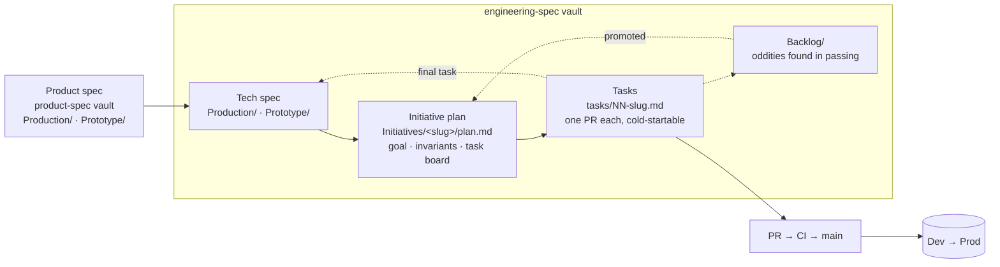

# Engineering Change Pipeline

How a decided product change becomes shipped code at BridgeCircle — and, more
specifically, how a **large** change survives being built across many separate
sessions that do not share memory.

This vault is the right-hand half of the
[Product to App Pipeline](../product-spec-obsidian-vault/Product%20to%20App%20Pipeline.md).
That note ends at *"Claude code → Tech Spec"*; this note picks up there.

## Which note am I writing?

The most common mistake is putting the right content in the wrong place. Four
note types, four different jobs:

| I want to record… | Goes in | Lifetime |
|---|---|---|
| How a subsystem is built today | `Production/` tech spec | Durable — lives as long as the code |
| How something *would* be built | `Prototype/` tech spec | Until built or abandoned |
| A large change in flight, and what is next | `Initiatives/<slug>/` | Finite — closes out |
| Something odd I noticed while doing other work | `Backlog/` | Until fixed, promoted, or dropped |
| A decision, with alternatives and consequences | [`docs/decisions/`](../docs/decisions/) (ADR) | Permanent |
| How to perform a procedure | [`docs/runbooks/`](../docs/runbooks/) | Durable |
| Facts about system shape | [`docs/architecture/`](../docs/architecture/) | Durable |

Tech specs, ADRs, and runbooks are *not* the same thing and should not absorb
each other. A tech spec that starts explaining how to run migrations should link
[`migration-workflow.md`](../docs/runbooks/migration-workflow.md) instead. A tech
spec that starts arguing for an approach is trying to be an ADR.

## The large-change loop

### 1. Plan once, in one session, with the whole picture loaded

A large change gets one planning session that produces
`Initiatives/<slug>/plan.md` **and every task file**, up front. Writing later
tasks later feels efficient and is the exact failure this structure exists to
prevent: the person who writes task 05 when its turn comes is a person who
already understands the change, so they write a task that only they can execute.
Write it while you can still remember what a stranger would not know.

Tasks are sized at **one focused session, one PR**. That sizing is not
aesthetic — it is what keeps a task inside a single context window, and what
lets the work merge as it goes: land each PR before starting the next, rather
than stacking branches that a later change can invalidate wholesale. Every
change routes through a PR; nothing is pushed to `main` directly.

### 2. Each task is picked up cold

A session arriving with no history does exactly this:

1. Read `plan.md` — **Goal**, **Invariants**, **Task board**. Stop there.
2. Take the lowest-numbered `ready` task whose `depends_on` are all `done`.
3. Mark it `in-progress`. Do that task and nothing else.
4. Verify with the commands written in the task, not with a judgment call.
5. Mark it `done`, record the PR, write **Handoff notes**, update the board row.

The **Invariants** section is what makes this safe. A session doing task 04 in
isolation cannot see that task 07 depends on a constraint holding — so the
constraint is written down where every task-level session reads it.

### 3. Distractions go to the backlog, not the diff

Finding something odd mid-task is normal and useful. Acting on it mid-task is
how a two-file change becomes a nine-file change that is hard to review and
harder to revert. Log it to [`Backlog/`](Backlog/README.md), link the file and
line, keep going.

The one exception: if the finding makes your current change wrong or unsafe, it
is part of your task now.

### 4. The initiative closes by updating the tech spec

The last task of an initiative should be *"update the `Production/` tech spec to
match what we built"* — an explicit task on the board, with a PR, like any other.
Otherwise the initiative closes, the knowledge leaves with the session that had
it, and the next large change starts from the code again.

Then set `status: done` and `closed:` in the plan frontmatter. The plan stays in
the vault as the record of why the change was sequenced the way it was.

## Working with the product vault

Read them together. The pairing is the point:

- A **product spec** in `Production/` should have a tech spec in this vault's
  `Production/`. If it does not, the subsystem's implementation lives only in
  the code and in whoever last touched it.
- A **tech spec** should name the product spec it implements in its frontmatter
  (`product_spec:`), and an initiative plan should name both.
- An idea in the product vault's `Prototype/` gets a tech spec here in
  `Prototype/` when someone works out *how* it would be built — which is often
  what reveals that the product spec is under-decided.
- **Vision** exists in both vaults and means the same thing in each: direction,
  not shippable scope. The product one holds where the product is going; this
  one holds the architecture that would have to be true to get there.

Cross-vault links are plain relative markdown links — Obsidian `[[wikilinks]]`
do not resolve across vaults.

## Status today

Honest state, in the spirit of the product pipeline note's status table.

| Piece | Status |
|---|---|
| Vault structure, templates, handoff protocol | ✅ This change |
| `Production/` tech specs | ❌ **None written yet** — the folder is empty. Backfill as subsystems are touched, not all at once |
| `Prototype/` tech specs | ❌ None yet |
| `Vision/` target architecture | ❌ None yet |
| Initiatives | ❌ None open yet — first large change opens the first one |
| Backlog | ✅ Ready to log into |
| ADRs / runbooks / architecture reference | ✅ Stay in [`docs/`](../docs/), linked from here, not migrated |

The intended fill order is **as work happens**, not as a documentation project:
the first large engineering change opens the first initiative, and its closing
task writes the first `Production/` tech spec.
