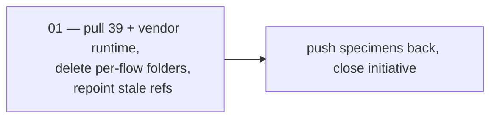

# Design templates sync-down (flat `screens/`)

> The whole shape of one engineering change. A session picking up work reads
> **Goal**, **Invariants**, and the **Task board** — nothing else — then opens its
> task file.

## Goal

The repo's copy of the Claude Design templates matches the restructured remote: a
single flat `templates/screens/` folder holding 26 screens plus the shared `Shell`,
`Card`, `Avatar`, `Toast` and `Screens` components, byte-identical to the remote,
with its runtime present so the mirror actually renders. The 15 per-flow folders
are gone, and nothing in the repo points at them any more.

## Why now

The remote restructured on 2026-08-14 and the repo has only 2 of the 41 files, so
the two sides disagree about the shape of the tree, not just its contents. Leaving
it half-pulled is the worst state: `templates/screens/` exists with two files while
15 per-flow folders hold a complete but superseded copy, so neither tree is
obviously authoritative.

The restructure itself is why it matters. Before it, 24 screens each carried a
hand-maintained copy of the sidebar and topbar, which had drifted into **13
different sidebars and 18 different topbars** — two back-button treatments, two
paddings, three bells. That is now one `Shell.dc.html`. Pulling it down is what
makes that consolidation available to production translation.

## Approach

One task. The pull is mechanical but has a fidelity constraint that dominates
everything else: **`DesignSync get_file` returns file bodies into the model
context, and content must never be retyped into a `Write` call** — a 30 KB HTML
file retyped by a model is a corrupted mirror that looks plausible. Extract from
the session transcript instead (script in the task file).

Second constraint: `DesignSync` is **main-thread only**. A subagent cannot see the
tool (confirmed 2026-08-14, after trying). This cannot be delegated.

## Invariants

- **Byte-exact or not at all.** Every pulled file comes from the transcript
  extraction path, never from retyping. A file whose fetch reported
  `"truncated": true` is refetched, not accepted.
- **The two files already on disk are never clobbered** —
  `templates/screens/Shell.dc.html` (34,856 b) and `templates/screens/ds-base.js`
  (925 b) were pulled correctly on 2026-08-14.
- **Pull only.** No `write_files` to the remote during the pull, and no git
  commits until verification passes.
- **Never delete the per-flow folders before the replacement is verified** —
  otherwise the repo briefly has no screens at all.
- Token parity with production stays light 249/249 and dark 67/67
  (`colors_and_type.css` is not touched by this initiative beyond what PR #194
  already did).

## Out of scope

- ~~`templates/sync-plan/**` and `uploads/repo_copy-*.html` — new remote files
  outside the requested scope. Not pulled, not deleted. Raise with Richard
  separately.~~ **Superseded 2026-08-14** — raised with Richard as planned, and he
  chose to delete all four rather than vendor them. See the decisions log.
- The remote README's own "Still to do" list (89 hand-rolled cards, remaining
  avatar sites, 110 hex literals). Those are template-side design work, not this
  sync.
- The two parked decisions in the [decision brief](https://claude.ai/code/artifact/83b41564-2943-48a8-92dc-a33e6409a812)
  — the 11px lifecycle badge and where the competitive verdicts live. Richard
  parked both until after this sync-down; revisit them once it lands.

## Task board

| # | Task | Status | Depends on | PR |
|---|---|---|---|---|
| 01 | [[Initiatives/design-templates-syncdown/tasks/01-pull-and-flatten\|Pull 39 screens, vendor the runtime, flatten the tree]] | done | — | [#194](https://github.com/dwrlee8517/BridgeCircle/pull/194) |

**Closed 2026-08-14.** All 42 files pulled and verified, the 15 per-flow folders
deleted, PR #194 merged as `c5c4164`, and the specimens pushed back. A structural
diff against `list_files` now returns nothing missing locally — the two sides are
at parity.

## Decisions log

- **2026-08-14** — Flat `screens/` accepted as-is; the per-flow folders are
  deleted rather than kept in parallel — Richard asked for the shape that cannot
  be confused later. Keeping both was rejected: it leaves two copies of all 26
  screens with nothing marking which is current.
- **2026-08-14** — `support.js` **is** vendored, reversing its exclusion from the
  original scope — Richard's call. It was excluded because the old tree carried 15
  copies of the same 64 KB runtime; the flat tree needs exactly one, and without it
  the local mirror cannot render at all.
- **2026-08-14** — Template authorship flips back to the **remote** for this
  change. Earlier the same day, `templates/README.md` was rewritten to say the repo
  was canonical (correct then: 24 screens had been authored in-repo on 07-15/16 and
  the remote had answered with nothing). The remote then authored this
  restructure, so the pulled README supersedes that rewrite.
- **2026-08-14** — Delegation to a subagent was tried and **failed**: `DesignSync`
  is not available off the main thread. Recorded so nobody spends the three minutes
  again.
- **2026-08-14** — The extraction path is **wider than the plan assumed**, and the
  plan's harvest script was incomplete as written. `get_file` results over roughly
  50 KB are spilled to `tool-results/*.txt` rather than inlined in the transcript,
  so a transcript-only scan misses the largest screens — 8 of the last 12 here.
  The script now reads both. This does not soften the byte-exact invariant: the
  sidecar is the tool's own JSON, untouched. Retyping remains forbidden.
- **2026-08-14** — The four out-of-scope remote files were **deleted, not
  vendored** — Richard's call once we looked at what they were. Three were
  `templates/sync-plan/`: the decision brief for this very sync, plus `ds-base.js`
  and a second 64 KB `support.js` copied there only so that one page could render.
  The fourth, `uploads/repo_copy-1786737908051-cmac.html`, was a pre-restructure
  snapshot of `Onboarding` — a 6-line diff from the canonical copy, and every one
  of those lines was an old per-flow link (`../home/Home.dc.html`). Keeping either
  would have contradicted the work: the first restores the duplicate runtime the
  flatten removed, the second preserves the paths this sync purged. The brief's
  four decisions are recorded here, so deleting it lost nothing.
- **2026-08-14** — `TOKEN-KINDS.md` said "22 unique" unclassifiable tokens while
  enumerating 21; Richard confirmed 21. Fixed locally and pushed back, since the
  file is remote-authored and would otherwise be clobbered on the next pull. Its
  header still cites the checker's "31 of 371", which does not reconcile with the
  33 declarations actually in `colors_and_type.css` — left alone rather than
  invented, because `check_design_system` was not re-run. Open loose end.

## Risks and rollback

| Risk | Signal it is happening | Response |
|---|---|---|
| A screen is silently truncated mid-pull | `verify_screens.py` flags a missing `</html>`, a zero-byte file, or a `truncated` fetch | Refetch that one path; the harvest script is idempotent and later-wins |
| Content retyped instead of extracted | Diff noise on files nobody edited; odd whitespace | Discard and re-extract from the transcript — never hand-repair |
| Per-flow folders deleted before the pull verifies | `verify_screens.py` reports fewer than 41 files while the old folders are already gone | `git checkout` the folders back; they are committed history until the deleting commit lands |
| A pulled screen references a token the repo lacks | `verify_screens.py` lists unresolved `var(--…)` | Report it, do **not** invent a token — it is a ledger question (`uploads/OVERRIDES.md`) |

## Related

- Sync log and pins — `docs/experience/ui/design-system/handoff/bridgecircle/.design-sync/NOTES.md`
- The restructure writeup, pulled from the remote — `docs/experience/ui/design-system/handoff/bridgecircle/project/templates/README.md`
- ADR 0013 (Toss baseline + brand overlay) — `docs/decisions/0013-toss-baseline-then-brand-overlay.md`
- PR #194 — the completed half of this sync (token `@kind` annotations, both `.md` files, base-path verification)
