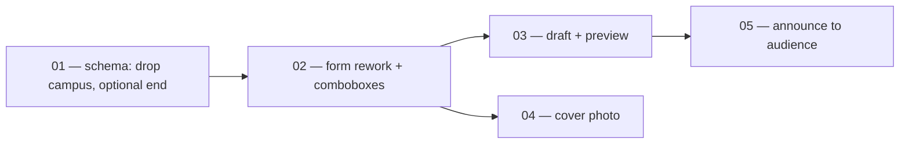

# Event composer v2

> The whole shape of one large engineering change. A session picking up work
> reads **Goal**, **Invariants**, and the **Task board** — nothing else — then
> opens its task file. Keep those three sections accurate above all others.

## Goal

The admin event composer is a one-screen-first form with a sticky section nav
and a Save draft · Preview · Publish action bar. Category and host are
add-or-type comboboxes, campus is gone end-to-end, the time zone picker covers
the full IANA list with a "use my time zone" fill, end time is optional,
location is only asked for when the format needs it, and every event can carry
a cover photo. Publishing and announcing are separate acts: an admin can
announce a published event to a faceted audience (class years / city / topic /
everyone) with a live recipient count, plus invite up to 10 specific members.

## Why now

The composer shipped 2026-07-23 as a straight column of 15+ fields that
publishes immediately — `status='draft'` exists in the schema with no UI, so
every typo goes live. `campus` is a Chadwick-shaped enum hardcoded into a
platform table, the check constraint (`events_campus_check`) blocks any second
pilot school, and the GraphQL initiative (graphql-data-plane task 03, still
`ready`) is about to freeze the admin event input shape into the graph and the
web↔mobile parity manifest. Reshaping the input **before** task 03 runs is the
cheap moment; after, every field change is a schema + manifest + mobile change.
Publish also notifies nobody today — the only event notifications go to people
who already RSVP'd — so events depend entirely on members visiting School.

## Approach

Five slices, each shippable alone, sequenced so schema-shape changes land
before the GraphQL initiative mirrors them. DB first (01 drops campus and
relaxes ends_at — the two contract changes), then the pure-UI form rework (02)
which needs 01's schema, then draft/preview (03) on the reworked form, then the
cover photo (04, independent of 03), then announce (05, largest and last
because it adds a new notification path rather than reshaping an old one).

Tasks 03 and 04 are parallel after 02. Task 05 depends on 03 only because
announce must never target a draft.

## Invariants

- Production data is never migrated destructively — expand/contract only
  (`docs/decisions/0008-deploy-ordering-expand-contract.md`). The campus
  column drop in 01 is safe only because prod runs the pre-pilot `test-org`;
  the migration must still be forward-only and idempotent.
- Business logic stays in `app/src/lib/` (`docs/decisions/0007-lib-discipline.md`);
  route handlers and server actions only parse/auth/call-lib/respond.
- The web↔mobile parity gate (`app/tests/e2e/admin/admin-surfaces.spec.ts`,
  `app/src/graphql/parity/manifest.ts`) stays green at every step — campus
  removal updates the manifest in the same PR that drops the field.
- Admin authorization stays in the RPCs (membership roles), mirrored by
  `loadSchoolAdminContext()`; no task adds a resolver- or client-side-only gate.
- Publish never notifies implicitly. Announce is always an explicit second act,
  respects notification preferences, and is rate-limited to once per event.
- Member-facing surfaces (School, home dashboard) keep rendering correctly at
  every intermediate state — check both after each task, not just admin.
- User-facing copy follows `docs/product/voice-guidelines.md` (§5.6 brevity);
  peer-to-peer moments (the capped invite list) get two-sided-buffer framing.

## Out of scope

- Recurring event series, registration questions, RSVP deadline, +1 guests,
  co-hosts, per-class-year event visibility — post-launch backlog; log in the
  product vault `Prototype/` if they firm up.
- Gallery photos beyond the single cover image (decision 2026-08-21: cover
  only).
- GraphQL exposure of any of this — that stays with graphql-data-plane task 03,
  which should be re-read against the new input shape when it starts.
- Announcement (the School post type) changes — this initiative touches events
  only.

## Task board

| # | Task | Status | Depends on | PR |
|---|---|---|---|---|
| 01 | [[Initiatives/event-composer-v2/tasks/01-schema-drop-campus-optional-end\|Schema: drop campus, optional end time]] | ready | — | |
| 02 | [[Initiatives/event-composer-v2/tasks/02-form-rework-comboboxes\|Form rework: sections, comboboxes, tz, conditional location]] | ready | 01 | |
| 03 | [[Initiatives/event-composer-v2/tasks/03-draft-and-preview\|Save as draft + member preview]] | ready | 02 | |
| 04 | [[Initiatives/event-composer-v2/tasks/04-cover-photo\|Cover photo: bucket, column, upload, render]] | ready | 02 | |
| 05 | [[Initiatives/event-composer-v2/tasks/05-announce-to-audience\|Announce: faceted audience + capped invites]] | ready | 03 | |

## Log

- **2026-08-21** — Initiative opened. Decisions from Richard: full campus
  removal (not admin-only hiding); single cover image (no gallery); announce =
  facets + capped ~10 invite list, separate from publish; draft + preview in
  scope, resolved-time echo folded into task 02 as a small line item; RSVP
  deadline / guests / duplicate deferred. Local main synced to origin/main
  (was 33 behind) before planning; graphql-data-plane task 03 confirmed not
  started, so input reshaping lands first.
