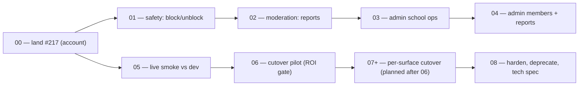

# GraphQL data plane

> The whole shape of one large engineering change. A session picking up work
> reads **Goal**, **Invariants**, and the **Task board** — nothing else — then
> opens its task file.

## Goal

GraphQL (code-first Pothos + Yoga at `app/src/app/api/graphql/route.ts`) is the
main data plane: every member and admin surface is queryable/commandable on the
graph, a parity harness has proven equivalence against the v2
`db/repositories/*` layer, and the web app's reads and writes have been cut
over from Server Actions to the graph, retiring the duplicated paths.

## Why now

Pre-graph, every surface hand-rolled its own data access and no list was
actually paginated. The graph gives one typed schema, real cursor pagination,
and per-request DataLoader batching. The strangler/parity approach (each
feature duplicated on the graph beside the existing path, diffed by an
integration harness, then deprecated) is what makes this safe on a live main.
Decision record: `docs/decisions/0017-graphql-data-plane.md`; parity protocol:
`docs/architecture/graphql-parity.md`.

## Approach

Vertical feature slices, one PR each, merged as soon as CI is green (never
stacked — a 4-deep stack was invalidated wholesale by the v2 rebuild once
already). Resolvers are thin delegates to `db/repositories/*`; all product
logic stays in the RPCs/repositories. **Status as of 2026-08-17: every member
surface is on the graph** (foundation+DataLoader, Member `me`, profile detail,
People search, Help reads+commands, Messages reads+commands, School,
Connections, Notifications+settings — PRs #170→#215; account lifecycle is
PR #217, in flight). What remains is the tail below, then the cutover.

Intermediate states are always shippable: the graph is additive until task 06;
nothing existing depends on it yet.

## Invariants

Checkable at every step; these protect cold sessions:

- **RLS is the security model.** Context (`app/src/graphql/context.ts`) builds
  the *user-scoped* client (cookie or `Authorization: Bearer`). No resolver
  ever touches `db/admin` / service-role. `grep -rn "admin" app/src/graphql/`
  should stay clean.
- **Resolvers are thin.** They delegate to `db/repositories/*` (or
  `lib/*/operations`) and only map shapes. Business logic never moves into the
  graph. (`docs/decisions/0007-lib-discipline.md`.)
- **Status vocabularies verbatim.** v2's status-discriminated results become
  uppercased GraphQL enums — never collapsed to ok/error booleans. Capacity
  valves, ALREADY_DECIDED, DUPLICATE, THROTTLED etc. are first-class outcomes.
- **Client-supplied idempotency keys** (`clientRequestId`/`clientNonce`) are
  required args on create/send commands — retries are only safe if the client
  reuses the key.
- **Membership resolved server-side** from `getMemberContext`; never accepted
  from the client. Never substitute a user id for a membership id.
- **Honest pagination.** True cursors only where the RPC pages (Help,
  Messages inbox 3-part cursor, message history by id, notifications keyset);
  bounded top-N results (`peopleSearch`, school lists) are plain
  `{ items, totalCount, capped }`/arrays — no fake connections.
- **Every slice updates the parity manifest**
  (`app/src/graphql/parity/manifest.ts`) — the schema↔manifest drift guard in
  `schema.test.ts` enforces existence; the shapeNotes are the harness contract.
- **`pnpm build` before pushing any `route.ts` change** — `tsc --noEmit` does
  not run Next's route-handler type validation.
- **Merge as we go**: one PR per task, merged green before the next. `--admin`
  only with explicit per-PR user approval, never scripted.

## Out of scope

- **pg_graphql / SDL-first / tRPC** — rejected in ADR 0017.
- **GraphQL subscriptions** — realtime stays on Supabase Realtime
  (`listAfter` + channels); the graph deliberately exposes no live transport.
- **Schema-breaking renames** while the parity harness consumes the manifest —
  additive only until cutover completes.
- **Repo auto-merge setting** — maintainer-only; recommended to Daniel
  (Settings → General → Allow auto-merge, per
  [[Backlog/pr-merge-race-strict-branch-plus-slow-ci]]).

## Task board

| # | Task | Status | Depends on | PR |
|---|---|---|---|---|
| 00 | [[Initiatives/graphql-data-plane/tasks/00-land-account-slice\|Land the account-lifecycle slice]] | in-progress | — | [#217](https://github.com/dwrlee8517/BridgeCircle/pull/217) |
| 01 | [[Initiatives/graphql-data-plane/tasks/01-safety-block-unblock\|Safety: block/unblock commands]] | ready | 00 | |
| 02 | [[Initiatives/graphql-data-plane/tasks/02-moderation-reports\|Moderation: reportAsk / reportOffer]] | ready | 01 | |
| 03 | [[Initiatives/graphql-data-plane/tasks/03-admin-school-ops\|Admin school ops (events + announcements)]] | ready | 02 | |
| 04 | [[Initiatives/graphql-data-plane/tasks/04-admin-members-reports\|Admin members + report queue]] | ready | 03 | |
| 05 | [[Initiatives/graphql-data-plane/tasks/05-live-smoke-dev\|Live authenticated smoke against dev]] | ready | 00 | |
| 06 | [[Initiatives/graphql-data-plane/tasks/06-cutover-pilot\|Cutover pilot: one screen reads via the graph (ROI gate)]] | blocked | 05 | |
| 08 | [[Initiatives/graphql-data-plane/tasks/08-harden-deprecate-spec\|Harden, deprecate, write the tech spec]] | blocked | 06 | |

Task 07 (per-surface cutover) is deliberately **not written yet**: its shape —
which surfaces, in what order, RSC in-process vs client-component HTTP —
depends on the 06 pilot's outcome. The session that closes 06 amends this plan
and writes the 07 tasks, per the "when the plan turns out to be wrong" rule.

## Decisions log

- **2026-08-05** — Code-first Pothos+Yoga over pg_graphql/tRPC — entity types +
  connections + delegation to `/lib`; pg_graphql reflects raw tables and
  bypasses business logic. (ADR, originally numbered 0014, renumbered 0017.)
- **2026-08-05** — `graphql` pinned to 16.13.2 via pnpm override — yoga's peer
  is 15||16; two graphql instances throw "from another module or realm".
  Vitest inlines graphql+pothos (`vitest.config.ts server.deps.inline`) for the
  same reason.
- **2026-08-07** — Yoga's `handleRequest` must be wrapped in a Next-shaped
  handler (`(request) => handleRequest(request, {})` returning
  `Response | Promise<Response>`) — exporting it directly fails `next build`'s
  route-type validation, which plain `tsc` never runs.
- **2026-08-08** — Re-pointed everything onto v2 `db/repositories/*` after the
  v2 rebuild deleted the pre-v2 tables/lib the first four PRs (#164–#169)
  targeted; those PRs were closed, not rebased. Lesson institutionalized as
  merge-as-we-go.
- **2026-08-08** — Bearer-token auth added to context
  (`db/server.createClientWithToken`) so the parity harness can call the
  endpoint as a specific user; cookie path unchanged for RSC.
- **2026-08-17** — Per-command status enums, not a shared error union — each
  repository result's vocabulary is its contract (createAsk's capacity valves,
  sendMessage's DUPLICATE/RATE_LIMITED, RSVP's OFFER_EXPIRED…). A shared enum
  would erase exactly the semantics the harness must verify.
- **2026-08-17** — Account lifecycle split from settings (different risk
  class); export download exposed only as a signed URL, never bucket/path.
- **2026-08-17** — Merge-race handling: honest loop (update → wait green →
  tight-poll ~20s → merge on CLEAN); `--admin` only with explicit per-PR
  approval. Docker Hub `toomanyrequests` Playwright failures are infra —
  `gh run rerun <id> --failed`.

## Risks and rollback

| Risk | Signal it is happening | Response |
|---|---|---|
| Resolver reaches for the service-role client | `db/admin` import under `app/src/graphql/` | Revert the resolver; the invariant grep is the review check |
| Schema drifts from the parity manifest | `schema.test.ts` drift guard fails | Fix in the same PR — the manifest is the harness's contract |
| v2 repository contracts change under the graph | `tsc` breaks in `app/src/graphql/entities/*` | Graph is additive until 06 — update the entity to the new contract; the repo layer is authoritative |
| Cutover pilot shows worse DX/perf than Server Actions | 06 handoff notes | Stop at pilot; graph remains the external/API surface only — amend this plan |

## Related

- ADR — `docs/decisions/0017-graphql-data-plane.md`
- Parity protocol — `docs/architecture/graphql-parity.md`
- Parity manifest — `app/src/graphql/parity/manifest.ts`
- Merge race backlog — [[Backlog/pr-merge-race-strict-branch-plus-slow-ci]]
