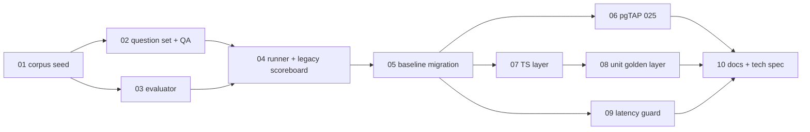

# Help search — golden dataset + deterministic baseline

> The whole shape of one large engineering change. A session picking up work
> reads **Goal**, **Invariants**, and the **Task board** — nothing else — then
> opens its task file. Keep those three sections accurate above all others.

## Goal

Help candidate search runs on a single deterministic algorithm (weighted helper-card
tsvector, OR-lexeme query, structural display rule — no embeddings, no reranker, no AI
budget spend), and its quality is measured by a golden evaluation dataset (dedicated
local eval org "Evalfield School" + labeled question set + `pnpm eval:search` runner)
that any future AI stage must beat to earn its way back in. A committed `legacy`
scoreboard records what the old pipeline scored; a `baseline-v1` scoreboard records the
new one.

## Why now

The 2026-08-14 dev investigation showed the shipped pipeline returns nothing when
embeddings are absent (they are absent everywhere: `private.profile_embedding_chunks`
has never been populated by seeds or backfill) and degrades silently (diagnostics
computed then discarded in the route). The lexical layer uses AND-semantics
`websearch_to_tsquery`, which scores full-sentence questions at zero, and the app-layer
0.12 threshold then filters everyone except verbatim topic-substring matches. There is
no eval harness anywhere in the repo, so no change to search can currently be called
better or worse. Product/priority rationale: see `memory_note` in frontmatter.

## Approach

Dataset first (it is the spec for the algorithm), runner second (run it against the
CURRENT algorithm to commit the honest "before" scoreboard), baseline third
(red → green against the committed dataset), guards and docs last. Every intermediate
state is shippable: the dataset and runner land without touching product code; the
migration + TS layer land as one atomic behavior change.

## Invariants

- Business logic stays in `app/src/lib/` (`docs/decisions/0007-lib-discipline.md`);
  route handlers parse/auth/call-lib/respond only.
- Migrations are forward-only and immutable once applied
  (`docs/runbooks/migration-workflow.md`). The return-shape change is drop+create in a
  NEW migration; `20260713231344_v2_init.sql` is never edited.
- **Eligibility gates are copied unchanged** into any rewrite of
  `private.search_help_candidates`: open_to_help, not paused, active user+membership,
  not viewer, not blocked, under `max_pending_requests`. A search improvement must
  never widen who is reachable.
- The eval org lives only in `app/supabase/seeds/` (local `db reset`); nothing in this
  initiative writes to dev or prod databases.
- pgTAP's exact-roster assertions on Chadwick Local (`1111…`) stay green — the eval org
  uses the disjoint `ee…` namespace and never touches Tier-1 rows.
- `api.search_help_candidates` **parameter list is unchanged** (incl. dormant
  `p_query_embedding`) so callers and `to_regprocedure` checks survive; only the return
  table changes.
- The golden fixture is engine-agnostic: evaluator and runner take
  `(question, org, viewer) → ranked memberships`; nothing in the dataset encodes
  baseline-specific behavior except via labels.
- `fail_ok` cases are excluded from pass/fail but always reported — they are the
  AI-lift ledger, not dead weight.

## Out of scope

- Dev embedding backfill (`private.mark_profile_index_dirty` sweep) — independent
  operational fix; do separately.
- Silent-degradation diagnostics logging in the candidates route — spun off as its own
  task (session chip, 2026-08-14).
- People directory search — keyword-only is correct for its query shape; untouched.
- Growing the question set v1 (~24) → comprehensive (~60) — post-baseline, by cloning
  axes when real queries surprise.
- Korean/bilingual queries, typo tolerance, connections-tier chunk visibility —
  recorded as `deferred_axes` in the fixture.

## Task board

`status` here mirrors each task file's frontmatter — the task file is authoritative if
they ever disagree.

| # | Task | Status | Depends on | PR |
|---|---|---|---|---|
| 01 | [[Initiatives/help-search-golden-baseline/tasks/01-eval-org-corpus-seed\|Eval-org corpus seed]] | done | — | |
| 02 | [[Initiatives/help-search-golden-baseline/tasks/02-golden-question-set\|Golden question set v1 + QA gate]] | done | 01 | |
| 03 | [[Initiatives/help-search-golden-baseline/tasks/03-shared-evaluator\|Shared evaluator (golden.ts)]] | done | 01 | |
| 04 | [[Initiatives/help-search-golden-baseline/tasks/04-eval-runner\|Eval runner + legacy scoreboard]] | done | 02, 03 | |
| 05 | [[Initiatives/help-search-golden-baseline/tasks/05-baseline-migration\|Baseline SQL migration]] | done | 04 | |
| 06 | [[Initiatives/help-search-golden-baseline/tasks/06-pgtap-contract\|pgTAP contract test 025]] | ready | 05 | |
| 07 | [[Initiatives/help-search-golden-baseline/tasks/07-ts-layer\|TS layer cutover]] | ready | 05 | |
| 08 | [[Initiatives/help-search-golden-baseline/tasks/08-unit-golden-layer\|Unit golden layer + snapshots]] | blocked | 07 | |
| 09 | [[Initiatives/help-search-golden-baseline/tasks/09-latency-guard\|Latency guard]] | ready | 05 | |
| 10 | [[Initiatives/help-search-golden-baseline/tasks/10-docs-and-tech-spec\|Docs + Production tech spec + close]] | blocked | 06, 08, 09 | |

## Decisions log

- **2026-08-15** — Dataset QA loop amendments while building the runner: the
  actuarial case's question reworded ('science'/'exams' had legitimate text
  matches elsewhere); capacity/blocked cases relabeled from `empty` to a new
  `invariants_only` expectation kind (other members may legitimately
  text-match; the assertion is the gated member's invisibility). Legacy
  scoreboard committed (12/25 with 2 expected misses; caveat: RPC-level
  measurement, upper bound on the shipped legacy UX which usually showed
  nothing).

- **2026-08-15** — Dedicated eval-only org instead of reusing Chadwick Local /
  Harborview — Chadwick Local's roster is frozen by pgTAP; Harborview's labels would be
  hostage to `DEMO_SEED`. Rejected: piggybacking on demo seeds (original draft).
- **2026-08-15** — Hand-authored core doubled 60 → 120 members (Richard) — headroom
  spent on multiple distractors per trap type and completeness-tier coverage.
- **2026-08-15** — Ambiguity is allowed only when labeled (`acceptable_surface` +
  ambiguous-by-design cases); unlabeled plausible candidates are dataset bugs caught by
  the QA gate — Richard's requirement, prevents noise being scored as model error.
- **2026-08-15** — Drop+create instead of `create or replace` for the RPC — Postgres
  rejects `or replace` when OUT columns change. Params kept identical on purpose.
- **2026-08-15** — Richard approved: the three tuning-phase relabels (fixture
  v1.1), the K=3 topic-cut display rule, and the load-spreading tiebreak. The
  dataset's v1 labels are final.
- **2026-08-15** — Final baseline scoring (measured, not guessed): rarity-weighted
  field sum replaces `ts_rank_cd` (unnormalized + no IDF); flat coverage term
  removed (rewarded generic words); topic bonus 0.5/0.8; K=3 topic-cut display
  rule. Golden set green 23/23 (+2 fail_ok ledger). Three labels revised during
  tuning and flagged NEEDS RE-REVIEW for Richard in the fixture.

- **2026-08-15** — Latency guard tripped at first measurement (5,658 ms at ~2k
  eligible helpers; nine tsvectors/row). Fixed inline without the stored-table
  escape hatch: one weighted tsvector per helper, unnested once; scoring moved
  from per-field sums to per-CLASS sums (once per lexeme per weight class).
  Golden set stayed fully green; 66 ms after. matched_fields is now
  class-granular.

## Risks and rollback

| Risk | Signal it is happening | Response |
|---|---|---|
| Inline helper-card tsvector too slow at scale | Task 09 latency guard fails (>1s at ~2k helpers) | Escape hatch: trigger-maintained `private.helper_search_documents` table (triggers fire on seed inserts, unlike RPC hooks) |
| `ts_rank_cd` unnormalized → 0.5 topic bonus dominates everything | Scoreboard shows field-locus/sparse-vs-rich regimes failing while keyword regimes pass | Tune constants in task 05's loop; the golden set is the arbiter, not intuition |
| Dataset noise (unlabeled plausible candidates) | Baseline "fails" cases a human would call passes | QA gate dispositions (task 02); treat as dataset bug, fix labels/corpus, never tune the engine to noise |
| Return-shape change breaks a caller not on the list | `tsc` or `check:help-cutover` failures beyond matching/route/worker | Compile-driven sweep in task 07; grep `search_help_candidates` + `HelpCandidate` before merging |
| Old pipeline needed after cutover | Product decision to re-enable AI stages | They are dormant, not deleted: providers are injected; route passes nulls. Re-enabling is a route-level change gated on beating `baseline-v1` scoreboard |

## Related

- Memory-vault decision — see `memory_note` in frontmatter (authorizes this work).
- Product spec — `../product-spec-obsidian-vault/Production/phase-1/spec.md` (Help),
  plus FLOWS.md §ask (search-first ask) in the design handoff bundle.
- ADRs — `docs/decisions/0009-*.md` (bounded AI matching), `docs/decisions/0011-*.md`
  (two verbs / one inbox).
- Runbooks — `docs/runbooks/migration-workflow.md`, `docs/runbooks/integration-testing.md`.
