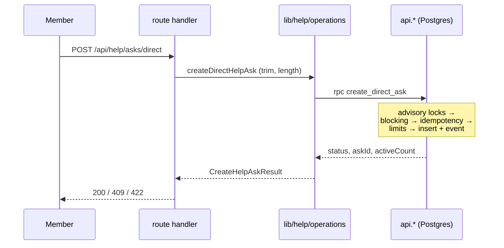

# Asks — tech spec

> How the ask subsystem is actually built. The product spec says what an ask
> does for a member and why; this says how the code makes that true. Where the
> two disagree on behavior, **the code is the fact**.

## What it does

A member asks for help; someone answers, and the pair lands in a conversation.
Two shapes exist, and the difference runs all the way to the database:

- **direct** — addressed to one member. The recipient accepts or declines.
- **circle** — broadcast to a `reach` (`matched` or `organization`). Any helper
  may *offer*; the asker accepts one of the offers.

Both terminate the same way: an accept mints a conversation and the ask becomes
`accepted`, then optionally `resolved`.

## Boundaries

| Concern | Owned here | Owned elsewhere |
|---|---|---|
| Ask/offer lifecycle and limits | `api.*` SQL functions | — |
| Input validation, shape rules | `app/src/lib/help/operations.ts` | — |
| Retrieval + ranking of helpers | `app/src/lib/help/matching.ts` | Embedding/rerank vendors behind `providers.ts` |
| The chat that follows an accept | — | `lib/conversations`, `lib/messages` |
| Notifications, email | — | `lib/notifications`, `private.enqueue_outbox` |
| Expiry / reminder sweeps | `api.run_help_maintenance` | Invoked by the Railway worker |

## Architecture — the load-bearing decision

**Business logic lives in Postgres, not in TypeScript.** Every state transition
is a `security definer` function in the `api` schema, and
`app/src/db/repositories/help.ts` is a thin adapter that calls it and parses the
row:

```ts
await memberClient.schema('api').rpc('create_direct_ask', { … })
```

`app/src/lib/help/operations.ts` still exists and still matters, but its job is
narrow: trim and length-check input, then delegate to a `HelpRepository` port
(`contracts.ts`). It holds **no** transition rules. That is what makes it
testable without a database, and it is why route handlers stay thin per
[ADR 0007](../../docs/decisions/0007-lib-discipline.md).

The consequence worth internalizing: **reading `lib/help/` alone will mislead
you about how asks behave.** Limits, idempotency, blocking, and every status
change are in the migration. Read the SQL.

## Data

Only what this subsystem touches; the full schema is
`docs/architecture/database-v2-contract.md`.

| Table | Notes |
|---|---|
| `public.asks` | One row per ask. Status, kind, both parties, `conversation_id`. |
| `public.ask_offers` | Circle-ask offers. `pending` → `accepted`/`declined`/`closed`. |
| `public.helper_preferences` | `open_to_help`, `paused_at`, `max_pending_requests` (default 10). |
| `public.helper_topics` | Up to 5 topics per helper. |
| `private.ask_matches` | Match records for circle asks. |
| `private.ask_events` | Append-only lifecycle log; drives the history timeline. |

`private.*` is revoked from `authenticated` outright — members reach data only
through `api` functions.

### The state machine is a CHECK constraint

This is the most important thing in the subsystem. `public.asks` carries a
`asks_kind_status_shape_check` that makes the two kinds structurally different,
not just conventionally:

```sql
(kind = 'direct'  and status in ('waiting','accepted','declined','retracted','resolved','closed')
                  and recipient_membership_id is not null
                  and reach is null and anonymous_until_accepted = false
                  and request_message is not null)
or
(kind = 'circle'  and status in ('open','accepted','retracted','resolved','closed')
                  and recipient_membership_id is null
                  and reach in ('matched','organization')
                  and request_message is null)
```

`waiting` is direct-only; `open` is circle-only. Alongside it sit lifecycle
checks that pin timestamps to statuses — `accepted` requires `accepted_at` and
`responded_at` and a null `ended_at`; `resolved` requires all three; `declined`
requires a decline note and is direct-only; `conversation_id` must be present
for `accepted`/`resolved` and absent for `waiting`/`open`/`declined`/`retracted`.

**An invalid ask state cannot be written, by any path.** A bug in application
code raises `23514` rather than corrupting a row. Treat these constraints as the
specification and application code as a client of it.

## Flow



Every creation and decision path funnels through a discriminated-union result
(`CreateHelpAskResult`, `HelpAskDecisionResult`, `HelpOfferDecisionResult`) whose
statuses the route maps to HTTP. There is no exception-driven control flow for
expected outcomes — `active_limit_reached` and `already_decided` are values, not
throws.

## Invariants

- **Five active asks per member.** Enforced in SQL as
  `v_active_count >= 5`, counting `waiting`/`open`/`accepted`.
- **Per-helper inbox cap.** A direct ask is refused with `helper_limit_reached`
  once the recipient has `max_pending_requests` asks in `waiting`.
- **Helper must be reachable.** Direct asks require the recipient `active`, with
  `open_to_help = true` and `paused_at is null`; otherwise `not_available`.
- **Blocking is honored at creation** via `private.is_blocked`.
- **You cannot ask yourself** (`asks_parties_differ_check`).
- **Idempotent creation.** `(asker_membership_id, client_request_id)` is unique.
  A replay with identical content returns `existing`; a replay of the same id
  with *different* content returns `idempotency_conflict` rather than silently
  creating or silently ignoring.
- **Accept implies a conversation.** Enforced by
  `asks_conversation_lifecycle_check`, not by convention.
- **Concurrency is serialized by advisory locks** — `private.lock_user_pair` and
  `private.lock_help_capacity` — so two simultaneous asks cannot both pass the
  limit check.

## Anonymity

Circle asks may be `anonymous_until_accepted`. This is a **database property**,
not a UI toggle: `HelpProfilePreview` is a union of `IdentifiedHelpProfile` and
`AnonymousHelpProfile`, and the `api` functions return the anonymous variant
until the ask is accepted. There is no client-side branch that could leak the
name by rendering the wrong field, because the field is not sent.

## Matching

`lib/help/matching.ts` ranks helpers for a circle ask: retrieve up to
`RETRIEVAL_LIMIT = 40`, rerank the top `RERANK_LIMIT = 20`, per
[ADR 0009](../../docs/decisions/0009-hybrid-ask-matching.md).

Both providers are optional (`providers.ts` types them as nullable) and every
degradation is *named* rather than swallowed — `HelpMatchingFallback` enumerates
`embedding_unavailable`, `embedding_failed`, `vector_retrieval_failed`,
`reranker_unavailable`, `reranker_failed`, `provider_limited`, and the active
fallbacks ride back in `diagnostics`. Matching degrades to deterministic scoring
rather than failing the request.

`api.consume_help_ai_budget` gates AI-assisted actions (`ask_draft`,
`offer_note`, `match_explanation`, `decline_note`, `candidate_search`) and can
answer `limited`.

Search must never widen the eligibility gates — the deterministic baseline
migration (`20260815090000_help_search_deterministic_baseline.sql`) says so
explicitly, and re-applies the blocked/paused/`max_pending_requests` filters.

## Operational notes

`api.run_help_maintenance(p_now, p_limit)` does the time-based work and is
**service-role only** — `authenticated` is denied execute, asserted in
`010_help_vertical_slice.test.sql`. It:

1. sends a reminder for direct asks `waiting` 5 days with no `reminder_sent_at`;
2. closes `waiting`/`open` asks past `expires_at` (default `now() + 14 days`).

It is driven by the Railway worker (`app/railway.worker.json` →
`pnpm worker:outbox` → `src/workers/outbox/main.ts`), which loops every
`MAINTENANCE_INTERVAL_MS = 60_000`. **If that worker is not running, asks never
expire and never remind**, and because the active-ask count has no expiry
filter, stale asks keep consuming a member's five slots. The worker is not
optional infrastructure.

## Tests

- Unit — `app/src/lib/help/*.test.ts` — validation, matching, cursors, golden
  ranking against `__fixtures__`. No database.
- Database — `app/supabase/tests/database/010_help_vertical_slice.test.sql` and
  `002_help_and_conversation_invariants.test.sql` — the constraint and grant
  surface. This is where the real state machine is covered.
- Integration — `app/tests/integration/help/circleAskLifecycle.int.test.ts`.
- E2E — `app/tests/e2e/help/{help-get,help-give,help-settings}.spec.ts`.

**Not covered:** no test asserts the two hard-coded `5`s agree (see below).

## Open questions

- **The active-ask limit is written twice.** `5` is a literal in the enforcement
  path (`v_active_count >= 5`) and again as the `active_ask_limit` returned by
  `api.get_help_home`. Nothing ties them together, so changing one silently
  makes the UI lie about the rule. Logged as
  [[2026-08-17-active-ask-limit-hardcoded-twice]].
- **`private.close_expired_asks` appears to be dead.** Defined in the init
  migration, referenced only by a test asserting `authenticated` lacks execute;
  expiry is actually handled inline by `run_help_maintenance`. Logged as
  [[2026-08-17-close-expired-asks-appears-unused]].
- A GraphQL surface for help exists (`src/graphql/entities/help.ts`,
  `help-mutations.ts`) alongside the REST routes, per
  [ADR 0017](../../docs/decisions/0017-graphql-data-plane.md). Which is
  canonical for new work is not settled here — see the parity manifest.

## Related

- Product spec — [user flows](../../product-spec-obsidian-vault/Production/phase-1/user-flows.md)
- Schema — [`database-v2-contract.md`](../../docs/architecture/database-v2-contract.md) · [`schema-rationale.md`](../../docs/architecture/schema-rationale.md)
- ADRs — [`docs/decisions/`](../../docs/decisions/)
