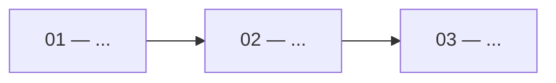

# <Initiative Name>

> The whole shape of one large engineering change. A session picking up work
> reads **Goal**, **Invariants**, and the **Task board** — nothing else — then
> opens its task file. Keep those three sections accurate above all others.

## Goal

What is true when this is done, in two or three sentences. Written as an end
state, not a list of activities.

## Why now

The forcing reason. What is painful today, or what this unblocks. This is the
section that stops a future session from quietly abandoning the change halfway
because the motivation was never written down.

## Approach

The strategy in a paragraph or a small diagram — how the change is sequenced and
why in that order. Note explicitly whether intermediate states must be
shippable (they usually must: this is a single-engineer build on a live main
branch).

## Invariants

Things that must stay true at **every** step, including halfway through. These
are what protect the sessions that pick up single tasks with no view of the
whole. Be specific and checkable.

- Production data is never migrated destructively — expand/contract only
  (`docs/decisions/0008-deploy-ordering-expand-contract.md`).
- Business logic stays in `app/src/lib/`
  (`docs/decisions/0007-lib-discipline.md`).
- <initiative-specific invariant>

## Out of scope

What this initiative deliberately does not do, and where that work goes instead
(a later initiative, `Backlog/`, or a `Prototype/` tech spec). Being explicit
here is what keeps task-level sessions from expanding the change.

## Task board

`status` here mirrors each task file's frontmatter — the task file is
authoritative if they ever disagree.

| # | Task | Status | Depends on | PR |
|---|---|---|---|---|
| 01 | [[Initiatives/<slug>/tasks/01-<slug>\|<title>]] | ready | — | |
| 02 | [[Initiatives/<slug>/tasks/02-<slug>\|<title>]] | ready | 01 | |
| 03 | [[Initiatives/<slug>/tasks/03-<slug>\|<title>]] | blocked | 02 | |

## Decisions log

Choices made mid-flight that a later session would otherwise re-litigate. Append
only, newest last, dated.

- **YYYY-MM-DD** — <decision> — <why, and what was rejected>

## Risks and rollback

| Risk | Signal it is happening | Response |
|---|---|---|
| <risk> | <what you would observe> | <revert path, feature flag, or fix-forward> |

## Related

- Product spec — <relative link into ../product-spec-obsidian-vault/>
- Tech spec — [[Production/<spec>]] or [[Prototype/<spec>]]
- ADRs — `docs/decisions/`
