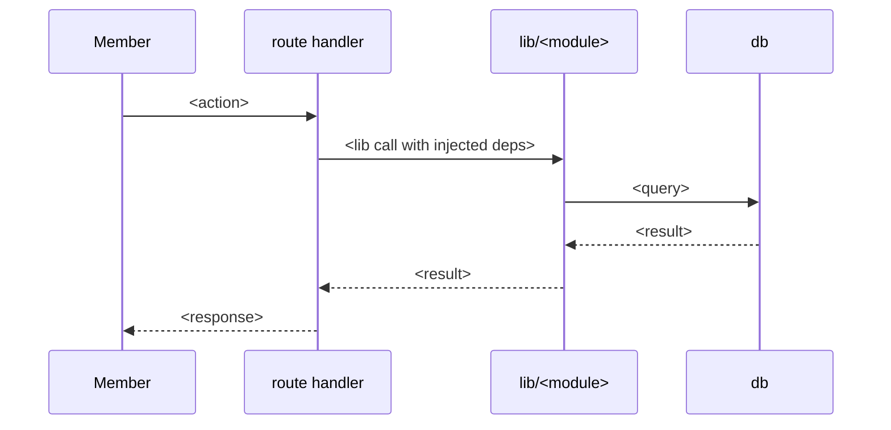

# <Subsystem> — tech spec

> How this subsystem is actually built. The product spec says what it does for a
> member and why; this says how the code makes that true. If the two disagree on
> behavior, the product spec is the intent and the **code is the fact** — fix
> whichever is wrong and flag it.

## What it does

One paragraph, in system terms. The member-facing framing belongs in the product
spec — link it rather than restating it.

## Boundaries

Where this subsystem starts and stops, and what it explicitly does not own.

| Concern | Owned here | Owned elsewhere |
|---|---|---|
| <concern> | `app/src/lib/<module>/` | `app/src/lib/<other>/` |

## Data

Tables, columns, and enums this subsystem reads and writes, and the RLS posture
on each. Reference `docs/architecture/database-v2-contract.md` for the full
schema and `docs/architecture/schema-rationale.md` for why it is shaped that
way, rather than duplicating either — list only what this subsystem touches and
what it assumes.

| Table | Reads | Writes | RLS notes |
|---|---|---|---|
| `<table>` | ✅ | ✅ | <policy shape> |

## Flow

The main path, end to end. A diagram is usually worth more than prose here.

## Invariants

What must always hold. These are the assertions a reviewer checks a change
against, and the ones worth having tests for.

- <invariant>

## Failure modes

What breaks, how it surfaces, and what the system does about it. Include the
degradation path — what a member sees when a dependency is down.

| Failure | Surfaces as | Handling |
|---|---|---|
| <third-party timeout> | <observable> | <fallback / retry / queue> |

## Feature flags and config

| Name | Values | Effect | Where read |
|---|---|---|---|
| `<ENV_VAR>` | <values> | <effect> | `app/src/lib/<...>` |

## Tests

Where the coverage lives and what it actually proves. Name the gaps honestly —
an unlisted gap reads as covered.

- Unit — `app/src/lib/<module>/*.test.ts` — <what it proves>
- E2E — <spec> — <what it proves>
- **Not covered:** <gap>

## Operational notes

Migrations that must run in a particular order, background jobs, sweeps, cost
guardrails, rate limits. Link the runbook rather than restating the procedure.

## Open questions

Known-unresolved design questions. Anything that becomes a concrete task belongs
in an initiative; anything smaller belongs in `Backlog/`.

## Related

- Product spec — <relative link>
- ADRs — `docs/decisions/`
- Runbooks — `docs/runbooks/`
