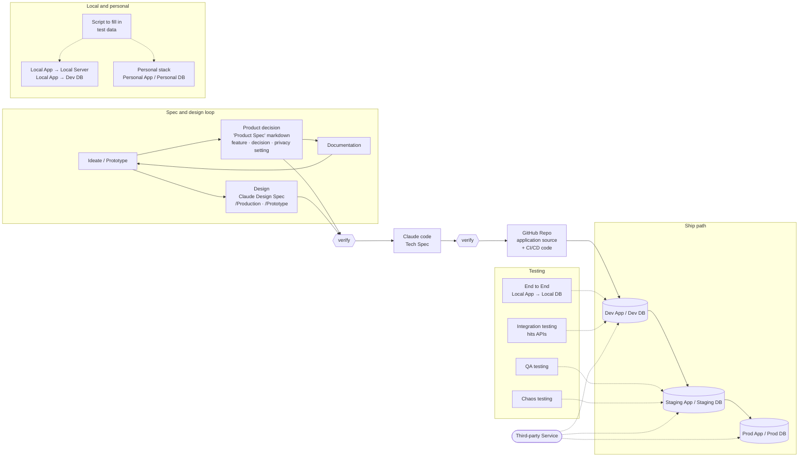
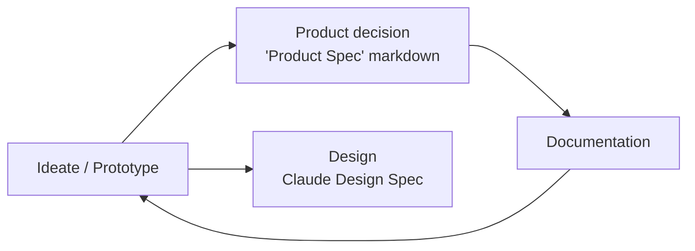

# Product to App Pipeline

How a product idea becomes a shipped app feature at BridgeCircle — from a decision written in this vault, through design and code, to production. This is the workflow the vault sits inside: the `Production/` and `Prototype/` folders here are one stage of it.

It is a **target** model. Some stages exist today, some are aspirational — each is annotated below, and the "Status today" column at the end is the honest summary. When this doc and the repo disagree, the repo wins; fix this file and flag it.

## The loop, stage by stage

### 1. Ideate → decide → design

The front of the pipeline is a loop, not a straight line. An idea is prototyped, written down as a decision, designed, documented, and the documentation feeds the next idea.

- **Ideate / Prototype** — the raw idea. Rough exploration before anything is committed. Personal drafts land in this vault's [`Prototype/`](Prototype/) folder; expect multiple parallel versions, none authoritative.
- **Product decision — the "Product Spec" markdown** — a written note describing *a feature, a decision, or a privacy setting*. This is the unit of intent: small, specific, decidable. Finalized specs graduate to [`Production/`](Production/).
- **Design — the Claude Design Spec** — the product decision, designed. Split the same way the vault is: `/Production` (the agreed-upon design) and `/Prototype` (drafts). Produced in the `bridgecircle` Claude Design project first, then translated to production UI ([design system](../docs/experience/ui/design-system/)).
- **Documentation** — the decision, once made, is written down; that documentation loops back into the next round of ideation. This is what keeps the front of the pipeline from re-litigating settled questions.

### 2. verify

A gate, not a stage. Before a spec/design becomes code, confirm it actually says what it should — the decision is sound, the design is complete, the privacy setting is right. Nothing moves right until it passes.

### 3. Claude code → Tech Spec

The verified product + design spec becomes code. The **Tech Spec** is the implementation-level counterpart to the product spec: how the feature is actually built. Code and tech spec are produced together.

### 4. verify

A second gate. The implementation is verified against the tech spec before it enters the repo — this is the [`/verify`](../docs/runbooks/e2e-testing.md) discipline: drive the change end-to-end and observe behavior, not just types and tests.

### 5. GitHub Repo — source + CI/CD

The verified code lands in the repository as two things:

- **application source file** — the feature itself.
- **CI/CD code** — the pipeline that carries it forward: lint, test, build, migration-safety, deploy. Wired at `.github/workflows/` today (`ci.yml`, `e2e.yml`).

From here the code flows through environments.

## The ship path: Dev → Staging → Prod

Each environment is an **App + DB** pair. Code promotes left to right; nothing reaches Prod that hasn't survived the environment before it.

- **Dev App / Dev DB** — the first cloud tier. Integration and end-to-end checks run here against real APIs and a real (throwaway) database.
- **Staging App / Staging DB** — a production-shaped rehearsal. QA and chaos testing happen here, where breaking things is safe.
- **Prod App / Prod DB** — real members, real data. Treated as untouchable from day-to-day development.

See [`environments.md`](../docs/architecture/environments.md) for the live env layout, [`branching-strategy.html`](../docs/architecture/branching-strategy.html) for how code promotes, and [`migration-workflow.md`](../docs/runbooks/migration-workflow.md) for how schema changes ride along safely.

## Testing layers

The diagram hangs specific test types off specific environments:

- **End to End (Local App → Local DB)** — the full stack driven locally against a local database. Fast, hermetic, no cloud dependency.
- **Integration testing (hits APIs)** — exercises the Dev tier against real third-party APIs, catching contract breaks a local mock would hide.
- **QA testing** — structured verification against Staging before a release is blessed.
- **Chaos testing** — deliberately injecting failure (latency, outages, bad data) at Staging to prove the system degrades gracefully.

## Supporting infrastructure

Around the main line, the whiteboard sketches the local and personal development surface:

- **Local App → Local Server / Local App → Dev DB** — how a developer runs the app on their laptop: either fully local, or a local app pointed at the shared Dev database.
- **Personal stack — Personal App / Personal DB** — an isolated per-developer environment, so one person's experiments never collide with another's.
- **Script to fill in test data** — seeds any of these databases with realistic fake data so features can be exercised without waiting for real usage. (See [`seed-dev.md`](../docs/runbooks/seed-dev.md).)
- **Third-party Service** — external dependencies (auth, email, LLM providers, enrichment) that every tier talks to.

## Where each stage lives in the repo today

Honest status — the diagram is the target; this is what exists now.

| Stage | Lives in / maps to | Status today |
|---|---|---|
| Ideate / Prototype | Vault [`Prototype/`](Prototype/) | ✅ Holds unbuilt specs — ask-mediator, conditional RSVP, post-launch backlog |
| Product Spec (markdown) | Vault [`Production/`](Production/) (implemented) + [`Prototype/`](Prototype/) (not yet built) | ✅ Phase-1 specs migrated in; classified by whether the feature ships in mainline |
| Claude Design Spec (Production/Prototype) | `bridgecircle` [design system](../docs/experience/ui/design-system/) | ✅ Design project + handoff exist |
| Documentation loop | [`docs/INDEX.md`](../docs/INDEX.md) as the manifest | ✅ Indexed docs; loop is informal |
| verify (both gates) | [`/verify`](../docs/runbooks/e2e-testing.md) discipline | ✅ Practiced; not an automated gate |
| Claude code / Tech Spec | [`app/`](../app/) source | ✅ Code exists; tech specs ad hoc |
| GitHub Repo — source + CI/CD | `.github/workflows/ci.yml`, `e2e.yml` | ✅ CI wired (biome, vitest, build, Playwright) |
| Dev App / Dev DB | `bridgecircle-dev` Supabase project | ✅ Exists |
| Staging App / Staging DB | — | ❌ **No staging tier today** — add when prod has real users and regressions have real cost |
| Prod App / Prod DB | `bridgecircle` Supabase + Railway | ✅ Exists |
| End-to-End (Local → Local DB) | `e2e.yml` / Playwright + local Supabase | ✅ Hermetic: local stack + `supabase/seeds/`, wiped and reseeded per run (see [[Testing Suite]]) |
| Integration testing (hits APIs) | — | 🟡 Partial via E2E; no dedicated integration tier |
| QA / Chaos testing | — | ❌ Not set up (depends on staging) |
| Local App / Personal stack | Laptop + `pnpm dev:local` → local Supabase (or `.env.local` → `bridgecircle-dev`) | ✅ Per-developer isolated stack via `pnpm db:start` + `db:reset` |
| Script to fill in test data | `app/supabase/seeds/seed.sql` (local/CI) + [`seed-dev.md`](../docs/runbooks/seed-dev.md) (remote dev) | ✅ Deterministic SQL seed + dev-project script |
| Third-party Service | Google OAuth, Resend, Sentry, Anthropic, Voyage | ✅ All wired ([environments.md](../docs/architecture/environments.md)) |

The two biggest gaps between the drawing and reality: **there is no Staging tier**, and **QA/Chaos testing depend on it**. Everything else is present in some form. Standing up staging is the single change that unlocks the most of the right-hand side of this diagram — but per [environments.md](../docs/architecture/environments.md), it's deliberately deferred until production has real users.

## Related

- Vault structure and the Production/Prototype convention — [`CLAUDE.md`](CLAUDE.md)
- Canonical docs manifest — [`docs/INDEX.md`](../docs/INDEX.md)
- Environments and deploy flow — [`environments.md`](../docs/architecture/environments.md)
